## Overview

This tutorial shows how to inspect raw **Illumina short reads** with `FastQC` before any trimming or filtering is applied.
You will use an **Arabidopsis** short-read dataset to identify which QC modules provide actionable evidence and which warnings should be interpreted in context rather than corrected automatically.



## Getting Started



**Tutorial Steps:**
1. [Prepare the practice workspace](#prepare-the-practice-workspace) for raw-read quality control (QC).
1. [Get the dataset](#get-the-dataset) and confirm the input files you will inspect.
1. [Run FastQC on raw reads](#run-fastqc-on-raw-reads) and generate per-sample reports.
1. [Review the report modules](#review-the-report-modules) for quality, adapter, duplication, and sequence-composition patterns.
1. [Compare read pairs and sample patterns](#compare-read-pairs-and-sample-patterns) to identify mate-specific issues before trimming.
1. [Decide on the next preprocessing step](#decide-on-the-next-preprocessing-step) and document whether trimming is justified.

## Tutorial Steps

<div class="process-list" markdown='1'>

### Prepare the practice workspace



### Get the dataset



<details class="padding-x-2 bg-success-lighter"><summary><i>command log</i></summary>

<pre><small>total 14G
-rw-r-----. 1 scinet-workbook 995M SRR4420293_1.fastq.gz
-rw-r-----. 1 scinet-workbook 1.0G SRR4420293_2.fastq.gz
-rw-r-----. 1 scinet-workbook 2.1G SRR4420294_1.fastq.gz
-rw-r-----. 1 scinet-workbook 2.1G SRR4420294_2.fastq.gz
-rw-r-----. 1 scinet-workbook 974M SRR4420295_1.fastq.gz
-rw-r-----. 1 scinet-workbook 982M SRR4420295_2.fastq.gz
-rw-r-----. 1 scinet-workbook 1.3G SRR4420296_1.fastq.gz
-rw-r-----. 1 scinet-workbook 1.4G SRR4420296_2.fastq.gz
-rw-r-----. 1 scinet-workbook 1.3G SRR4420297_1.fastq.gz
-rw-r-----. 1 scinet-workbook 1.3G SRR4420297_2.fastq.gz
-rw-r-----. 1 scinet-workbook 1.4G SRR4420298_1.fastq.gz
-rw-r-----. 1 scinet-workbook 1.4G SRR4420298_2.fastq.gz
</small></pre>
</details>

In this QC tutorial, you are using the raw paired-end reads directly so you can inspect the original quality profile before any trimming or filtering changes the data.

### Run FastQC on raw reads



<div class="usa-accordion" data-allow-multiple>

<div id="fastqc-tool-setup" class="accordion_content" markdown='1' hidden>





</div>


<div id="fastqc-live-first" class="accordion_content" markdown='1' hidden>

Start with **one paired-end sample** (`R1` + `R2`) in the interactive session. `FastQC` is usually quick enough that you can watch it finish, confirm that the `.html` and `.zip` outputs are created, and check that they are written to the expected directory before repeating the task for all files.

For `FastQC`, the main choices are which input files you want to inspect together, how many CPU threads you want to use, and which output directory should collect the reports.

<div class="table-small" markdown="1">

| Option | Description | Example |
| --- | --- | --- |
| `--threads` | Number of CPU threads used by `FastQC` | `--threads 2` |
| `--outdir` | Directory where the `.html` and `.zip` reports will be written | `--outdir fastqc_SRR4420293` |
| `mkdir -p` | Create the output directory before writing reports into it | `mkdir -p fastqc_SRR4420293` |
| input files | One or more `FASTQ` files to summarize | `SRR4420293_1.fastq.gz SRR4420293_2.fastq.gz` |

</div>

### Run a command

Use one paired-end sample directly from the [dataset location](#get-the-dataset). For a first QC pass, keep the output directory tied to the sample name so the reports stay easy to match to the input reads:

```bash
cd {{ page.tutorial.root_practice }}/{{ page.tutorial.workdir }}

INPUT_DIR={{ page.tutorial.data_path }}
R1=${INPUT_DIR}/SRR4420293_1.fastq.gz
R2=${INPUT_DIR}/SRR4420293_2.fastq.gz
OUTDIR=fastqc_SRR4420293

mkdir -p ${OUTDIR}
fastqc --threads 2 --outdir ${OUTDIR} ${R1} ${R2}
```

<details class="padding-x-2 bg-success-lighter"><summary><i>command log</i></summary>

<pre><small>Started analysis of SRR4420293_1.fastq.gz
Started analysis of SRR4420293_2.fastq.gz
...
Analysis complete for SRR4420293_2.fastq.gz
Analysis complete for SRR4420293_1.fastq.gz

Peak system RAM: 941.62 MB
real    2m14.327s
user    4m13.450s
sys     0m6.379s
</small></pre>
</details>

*This two-thread run took about 2.2 minutes and used just under 1 GB of memory.*


### Validate the output before scaling up

First, confirm that the expected `FastQC` reports were created in your practice workspace:

```bash
ls -lh ${OUTDIR}
```

*You should see one `.html` report and one `.zip` archive for each mate.*

<pre><small>647K SRR4420293_1_fastqc.html
474K SRR4420293_1_fastqc.zip
640K SRR4420293_2_fastqc.html
471K SRR4420293_2_fastqc.zip
</small></pre>

Next, confirm that both mate reports exist:

```bash
ls -lh ${OUTDIR}/*_fastqc.html
```

<pre><small>647K fastqc_SRR4420293/SRR4420293_1_fastqc.html
640K Sep fastqc_SRR4420293/SRR4420293_2_fastqc.html
</small></pre>

Then, inspect the module summary inside one of the report archives:

```bash
unzip -p "${OUTDIR}/SRR4420293_1_fastqc.zip" "SRR4420293_1_fastqc/summary.txt"
```

<pre><small>PASS    Basic Statistics                SRR4420293_1.fastq.gz
PASS    Per base sequence quality       SRR4420293_1.fastq.gz
WARN    Per tile sequence quality       SRR4420293_1.fastq.gz
PASS    Per sequence quality scores     SRR4420293_1.fastq.gz
FAIL    Per base sequence content       SRR4420293_1.fastq.gz
WARN    Per sequence GC content         SRR4420293_1.fastq.gz
PASS    Per base N content              SRR4420293_1.fastq.gz
PASS    Sequence Length Distribution    SRR4420293_1.fastq.gz
FAIL    Sequence Duplication Levels     SRR4420293_1.fastq.gz
WARN    Overrepresented sequences       SRR4420293_1.fastq.gz
PASS    Adapter Content                 SRR4420293_1.fastq.gz
</small></pre>

Use this summary to see if all modules were assessed.
*Do not worry about `FAIL` or `WARN` statuses yet; those will be examined in the report-review section below. At this stage, the goal is to confirm that FastQC produced valid output before scaling up.*

</div>

<div id="fastqc-slurm-all" class="accordion_content" markdown='1' hidden>



1. In your practice workspace, create a SLURM script file and open it for editing:
```bash
cd {{ page.tutorial.root_practice }}/{{ page.tutorial.workdir }}
touch fastqc_batch.sh
nano fastqc_batch.sh
```

1. Copy and paste the following script body. Before saving it, inspect the path settings carefully. Use `pwd` in your current workspace if you want to confirm the absolute working-directory path.

    <div id="fastqc-walltime-estimate-wrapper" class="usa-accordion">
    
    <div class="accordion_content" id="fastqc-walltime-estimate" markdown='1' hidden>

    The interactive pilot processed one paired-end sample (two FASTQ files) in `2m14s`. To estimate walltime, divide the total number of FASTQ files by the number of available threads. This gives the number of file groups processed one after another:
    ```text
    n_groups = ceil(total_FASTQ_files / threads)
    walltime ≈ pilot_runtime × n_groups
    ```
    This dataset contains 12 FASTQ files. On both SCINet clusters, any node can provide 12 CPUs, so all files can run in one batch:
    ```text
    n_groups = 12/12 = 1
    walltime ≈ 134 seconds × 1 ≈ 2.5 minutes
    ```
    When estimated walltime is only a few minutes, request `00:30:00` to provide additional buffer for filesystem variability.
    </div>
    </div>
```bash
   #!/bin/bash
   #SBATCH --job-name=fastqc_arabidopsis
   #SBATCH --partition=<value>                      # EDIT: on Ceres: ceres, scavenger; on Atlas: atlas
   #SBATCH --nodes=1
   #SBATCH --ntasks=1
   #SBATCH --cpus-per-task=12                       # EDIT: one CPU for each FASTQ file; up to 72-96 on Ceres; up to 48 on Atlas
   #SBATCH --account=<account>                      # EDIT: specify project account
   #SBATCH --mem=16G                                # EDIT: adjust with benchmark; reserve enough memory for parallel files
   #SBATCH --time=00:30:00                          # EDIT: adjust with estimate for the entire dataset; add +10% buffer
   #SBATCH --output=fastqc_batch_%j.log

   module load fastqc

   INPUT_DIR={{ page.tutorial.data_path }}
   WORKDIR={{ page.tutorial.root_practice }}/{{ page.tutorial.workdir }}
   OUTDIR=${WORKDIR}/{{ page.tutorial.output_dir }}

   mkdir -p "${OUTDIR}"
   time fastqc --threads 12 --outdir "${OUTDIR}" "${INPUT_DIR}"/*.fastq.gz
```

    - <small>`FastQC` accepts multiple input files and writes individual reports to one output directory.</small>
    - <small>`--time=00:30:00` reserves 30 minutes for the complete batch run.</small>
    - <small>`--mem=16G` provides headroom while the 12 files are processed in parallel.</small>
    - <small>`--threads` and `#SBATCH --cpus-per-task` must always have the same value.</small>
      - <small>`--threads` tells FastQC how many CPUs to use</small> 
      - <small>`#SBATCH --cpus-per-task` reserves those CPUs</small>

    <div class="highlighted highlighted--highlighted margin-bottom-2"><div class="highlighted__body"  markdown="1">
    **FastQC can use up to 4 threads per file**, and requesting more would provide no additional benefit. For this 12-file dataset, 48 threads would be the maximum useful allocation, while 12 threads are still enough to start all files concurrently.
    </div></div>


1. Submit batch job with:
```bash
sbatch fastqc_batch.sh
```
    <pre><small>Submitted batch job 22002965</small></pre>

1. Then check whether the job is queued or running and inspect the batch log file for any immediate errors:
```bash
squeue -u $USER
```
   
   <pre><small>   JOBID PARTITION     NAME     USER ST       TIME  NODES NODELIST(REASON)
   22002965     ceres fastqc_a alex.bad  R       1:49      1 ceres20-mem-2
   </small></pre>

   ```bash
   less fastqc_batch_*.log
   ```

   <details class="padding-x-2 margin-bottom-2 bg-success-lighter"><summary><i>command log</i></summary>

   <pre><small>Started analysis of SRR4420293_1.fastq.gz
   Started analysis of SRR4420293_2.fastq.gz
   Started analysis of SRR4420294_1.fastq.gz
   Started analysis of SRR4420294_2.fastq.gz
   Started analysis of SRR4420295_1.fastq.gz
   Started analysis of SRR4420295_2.fastq.gz
   Started analysis of SRR4420296_1.fastq.gz
   Started analysis of SRR4420296_2.fastq.gz
   Started analysis of SRR4420297_1.fastq.gz
   Started analysis of SRR4420297_2.fastq.gz
   Started analysis of SRR4420298_1.fastq.gz
   Started analysis of SRR4420298_2.fastq.gz
   Approx 5% complete for SRR4420293_1.fastq.gz
   Approx 5% complete for SRR4420293_2.fastq.gz
   Approx 5% complete for SRR4420295_1.fastq.gz
   ...
   </small></pre>
   </details>

1. Optionally, wait a while to confirm that the expected report files are being produced in your practice workspace.
```bash
   ls -lh {{ page.tutorial.output_dir }}/
```

   <details class="padding-x-2 bg-success-lighter"><summary><i>command log</i></summary>

   <pre><small>total 14M
   647K SRR4420293_1_fastqc.html      474K SRR4420293_1_fastqc.zip
   640K SRR4420293_2_fastqc.html      471K SRR4420293_2_fastqc.zip
   657K SRR4420294_1_fastqc.html      480K SRR4420294_1_fastqc.zip
   648K SRR4420294_2_fastqc.html      471K SRR4420294_2_fastqc.zip
   646K SRR4420295_1_fastqc.html      472K SRR4420295_1_fastqc.zip
   638K SRR4420295_2_fastqc.html      468K SRR4420295_2_fastqc.zip
   645K SRR4420296_1_fastqc.html      471K SRR4420296_1_fastqc.zip
   645K SRR4420296_2_fastqc.html      479K SRR4420296_2_fastqc.zip
   642K SRR4420297_1_fastqc.html      468K SRR4420297_1_fastqc.zip
   640K SRR4420297_2_fastqc.html      469K SRR4420297_2_fastqc.zip
   640K SRR4420298_1_fastqc.html      467K SRR4420298_1_fastqc.zip
   642K SRR4420298_2_fastqc.html      471K SRR4420298_2_fastqc.zip
   </small></pre>
   </details>


After the job finishes, check the final lines of `fastqc_batch_*.log`:
```bash
tail -5 fastqc_batch_*.log
```
<pre><small>...
real    4m56.988s
user    36m20.610s
sys     0m37.068s
</small></pre>
The interactive pilot and the SLURM batch job assumed one CPU per input FASTQ file. The batch still took about 5 minutes versus about 2 minutes for the pilot because individual sample file sizes and processing loads can differ and FastQC parallel processing can increase I/O contention and memory use. This proves that adding a safety buffer is important when [estimating walltime](#fastqc-walltime-estimate-wrapper).



</div>
</div>


### Review the report modules



<!--
*Use this summary to see which modules passed, warned, or failed before you decide whether trimming is justified.*
*If read 2 shows systematically worse quality or stronger adapter signal than read 1, note that before choosing the next cleanup tool.*
-->

FastQC creates two reports for each input file:

- an `.html` report for visual review;
- a `.zip` archive containing machine-readable summaries, detailed tables, and images.

The HTML reports cannot be directly viewed from the SCINet command-line session, although they can be [previewed in SCINet Desktop or downloaded for visual review](#3-preview-only-selected-html-reports). However, when a project contains tens or hundreds of samples, reviewing every HTML report manually is impractical. Instead, first extract key statistics from the `.zip` archives for all samples on the HPC system, then use those results to select representative reports and unusual samples for detailed visual review.


<div class="process-list ul" markdown='1'>

### 1. Check summary flags

Move into the directory containing the reports:
```bash
# If you start this section in a new shell, set the report directory again.
OUTDIR={{ page.tutorial.root_practice }}/{{ page.tutorial.workdir }}/{{ page.tutorial.output_dir }}
cd "${OUTDIR}"
```

#### Check that every input has both a `.zip` and an `.html` report

Use the input `FASTQ` files as the authoritative list of expected outputs. 
- The complete per-input presence check is saved in `fastqc_output_presence.txt`. 
- The final command highlights missing report files; no output from `grep` means that every input has both expected FastQC reports.

```bash
INPUT_DIR={{ page.tutorial.data_path }}

for input in "${INPUT_DIR}"/*.fastq.gz; do
    stem="$(basename "${input}" .fastq.gz)"
    if [[ -f "${stem}_fastqc.zip" && -f "${stem}_fastqc.html" ]]; then
        printf '%s\tOK\n' "${stem}"
    else
        [[ -f "${stem}_fastqc.zip" ]] || printf '%s\tMISSING ZIP\n' "${stem}"
        [[ -f "${stem}_fastqc.html" ]] || printf '%s\tMISSING HTML\n' "${stem}"
    fi
done > fastqc_output_presence.txt

grep 'MISSING' fastqc_output_presence.txt || echo 'No missing report files found.'
```

<pre><small>No missing report files found.</small></pre>

#### Extract QC modules summaries

Print the module summaries for every ZIP archive:

```bash
for report in *_fastqc.zip; do
    report_dir="${report%.zip}"
    printf '\n=== %s ===\n' "${report_dir}"
    unzip -p "${report}" "${report_dir}/summary.txt"
done | tee fastqc_summary_all.txt
```
<details class="padding-x-2 bg-success-lighter"><summary><i>command log (showing one sample only)</i></summary>

<pre><small>=== SRR4420293_1_fastqc ===
PASS    Basic Statistics                SRR4420293_1.fastq.gz
PASS    Per base sequence quality       SRR4420293_1.fastq.gz
WARN    Per tile sequence quality       SRR4420293_1.fastq.gz
PASS    Per sequence quality scores     SRR4420293_1.fastq.gz
FAIL    Per base sequence content       SRR4420293_1.fastq.gz
WARN    Per sequence GC content         SRR4420293_1.fastq.gz
PASS    Per base N content              SRR4420293_1.fastq.gz
PASS    Sequence Length Distribution    SRR4420293_1.fastq.gz
FAIL    Sequence Duplication Levels     SRR4420293_1.fastq.gz
WARN    Overrepresented sequences       SRR4420293_1.fastq.gz
PASS    Adapter Content                 SRR4420293_1.fastq.gz

=== SRR4420293_2_fastqc ===
PASS    Basic Statistics                SRR4420293_2.fastq.gz
PASS    Per base sequence quality       SRR4420293_2.fastq.gz
PASS    Per tile sequence quality       SRR4420293_2.fastq.gz
PASS    Per sequence quality scores     SRR4420293_2.fastq.gz
FAIL    Per base sequence content       SRR4420293_2.fastq.gz
FAIL    Per sequence GC content         SRR4420293_2.fastq.gz
PASS    Per base N content              SRR4420293_2.fastq.gz
PASS    Sequence Length Distribution    SRR4420293_2.fastq.gz
FAIL    Sequence Duplication Levels     SRR4420293_2.fastq.gz
WARN    Overrepresented sequences       SRR4420293_2.fastq.gz
PASS    Adapter Content                 SRR4420293_2.fastq.gz

...<i>(x number of samples)</i>
</small></pre>
</details>


#### Count the QC status flags



To count the flags across all reports, use the saved summary file:

```bash
grep -E '^(PASS|WARN|FAIL)[[:space:]]' fastqc_summary_all.txt \
    | awk '{count[$1]++} END {for (status in count) print status, count[status]}' | sort -nk2
```

<pre><small>WARN 25
FAIL 29
PASS 78
</small></pre>

To list each unique module with a `FAIL` status, count the affected files in read 1 and read 2:

```bash
READ1_SUFFIX="{{ page.tutorial.read1_suffix }}"
READ2_SUFFIX="{{ page.tutorial.read2_suffix }}"

awk -v read1_suffix="${READ1_SUFFIX}" -v read2_suffix="${READ2_SUFFIX}" 'BEGIN { printf "%-40s %10s %10s %-55s %-55s\n", "module", "FAIL_in_1", "FAIL_in_2", "samples_in_1", "samples_in_2" }
$1 == "FAIL" {
    input = $NF
    mate = substr(input, length(input) - length(read1_suffix) + 1) == read1_suffix ? 1 : (substr(input, length(input) - length(read2_suffix) + 1) == read2_suffix ? 2 : 0)
    if (mate == 0) next
    sample = input
    sub(/_[12]\.fastq\.gz$/, "", sample)
    module = $2; for (i = 3; i < NF; i++) module = module " " $i
    failed[module, mate]++; modules[module] = 1
    if (!seen[module, mate, sample]++) samples[module, mate] = samples[module, mate] (samples[module, mate] ? "," : "") sample
} END {
  for (module in modules)
    printf "%-40s %10d %10d %-55s %-55s\n", module, failed[module, 1] + 0, failed[module, 2] + 0, samples[module, 1], samples[module, 2]
}' fastqc_summary_all.txt
```

<pre><small>module                                    FAIL_in_1  FAIL_in_2 samples_in_1                                                      samples_in_2                                           
Sequence Duplication Levels                       6          6 SRR4420293,SRR4420294,SRR4420295,SRR4420296,SRR4420297,SRR4420298 SRR4420293,SRR4420294,SRR4420295,SRR4420296,SRR4420297,SRR4420298
Per base sequence content                         6          6 SRR4420293,SRR4420294,SRR4420295,SRR4420296,SRR4420297,SRR4420298 SRR4420293,SRR4420294,SRR4420295,SRR4420296,SRR4420297,SRR4420298
Overrepresented sequences                         1          1 SRR4420296                                                        SRR4420296                                             
Per sequence GC content                           0          3                                                                   SRR4420293,SRR4420295,SRR4420296           
</small></pre>

---

[Summarize all reports in the CLI](#1-check-qc-status-in-the-cli) answers three practical questions without opening any report:

1. ***Were reports produced for every input file?***  
*Yes, see [Check that every input has both a .zip and an .html report](#check-that-every-input-has-both-a-zip-and-an-html-report)*
2. ***Do the paired reads show broadly similar module results?***  
*Yes, the same modules failed for read 1 and read 2: `Sequence Duplication Levels `and `Per base sequence content` across all samples*
3. ***Is one sample or mate an obvious outlier that deserves detailed review?***  
*Yes, sample `SRR4420296` has overrepresented sequences and **read 2** of samples `SRR4420293`, `SRR4420295`, `SRR4420296` failed with per sequence GC content.*




### 2. Open HTML reports



- The **HPC shell** cannot display HTML reports conveniently.
- SCINet OnDemand **File Browser** may not render HTML reports reliably, but you can use it to [download selected reports](#download-html-report). 
- SCINet OnDemand **Desktop** lets you [view HTML reports](#preview-in-scinet-desktop) from their cluster location directly in a web browser.


#### Preview in SCINet Desktop



#### Download to a local machine

1. You can download selected reports manually from the **OnDemand Files**.

    <details class="margin-left-2 margin-top-0" markdown="1"><summary class="text-base"><i>see a screenshot</i></summary>

    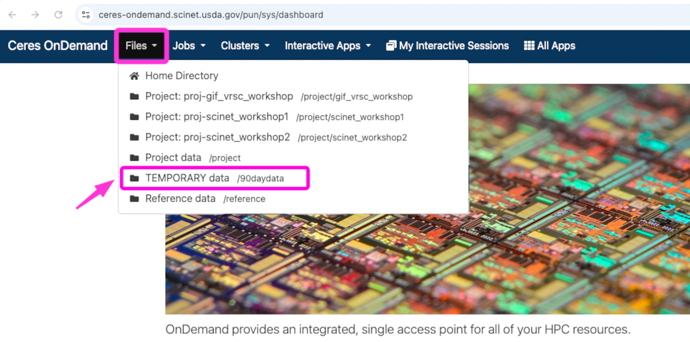  

    In the path bar in the pop-up window, place the cursor at the end of the current path and enter `shared/<user.name>`. Press Enter to navigate to the specified path.  

    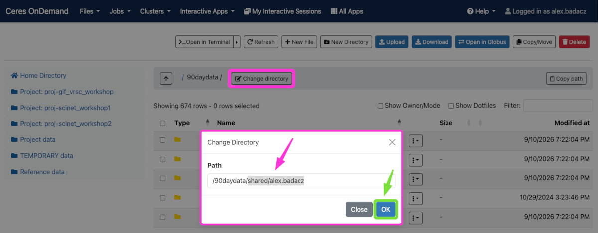  

    Navigate through the nested folders until you reach the `fastqc_all` folder.  

    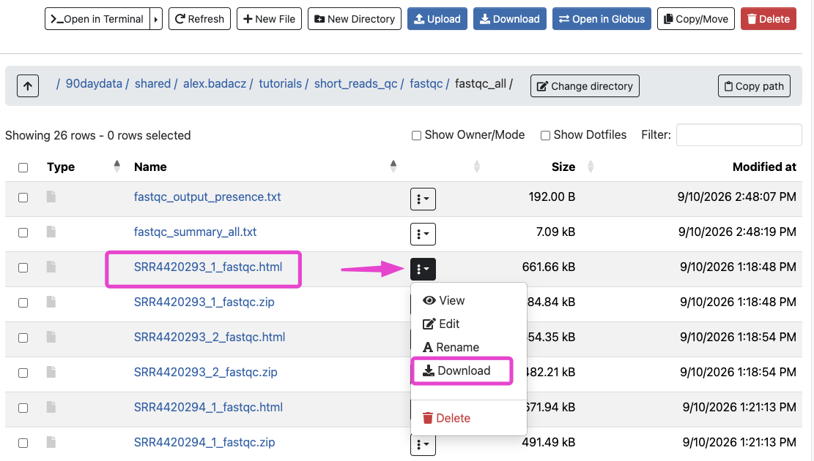
    </details>

1. Alternatively, use `scp` from your local computer's terminal to download a few files. 
Replace `<scinet_username>` with your SCINet username and use the command for the cluster where the files are stored:
    ```bash
    # Ceres
    scp <scinet_username>@ceres-dtn.scinet.usda.gov:'{{ page.tutorial.root_practice }}/{{ page.tutorial.workdir }}/{{ page.tutorial.output_dir }}/SRR4420293_1_fastqc.html' .

    # Atlas
    scp <scinet_username>@atlas-dtn.hpc.msstate.edu:'{{ page.tutorial.root_practice }}/{{ page.tutorial.workdir }}/{{ page.tutorial.output_dir }}/SRR4420293_1_fastqc.html' .
    ```

1. For larger transfers, use [Globus](https://scinet.usda.gov/guides/data/transfer/globus). 


Open the downloaded file locally in a web browser and [review QC modules](#3-review-qc-modules).


### 3. Review QC modules

FastQC reports contain multiple QC modules. Use the [summary flags](#count-the-qc-status-flags) to decide which modules need closer review; the same flag can have different implications depending on the data. Start with flagged modules, then compare them across samples and paired reads. A warning or failure alone does not specify a trimming threshold. 

*The tabs below explain what each module measures and how to interpret its result.*


<div class="usa-accordion" data-allow-multiple>


<div id="fastqc-module-basic-statistics" class="accordion_content" markdown="1" hidden>

Lists basic information about the input file.
- The table reports the filename, file type, encoding, number of sequences, total bases, sequences flagged as poor quality, read length, and GC percentage.

Typical patterns:
- An expected filename, read length, encoding, and approximate read count: the correct input appears to have been analyzed.
- An unexpected value: check for the wrong input, a damaged file, or a library type that needs explanation. This module is an orientation check rather than a trimming decision.

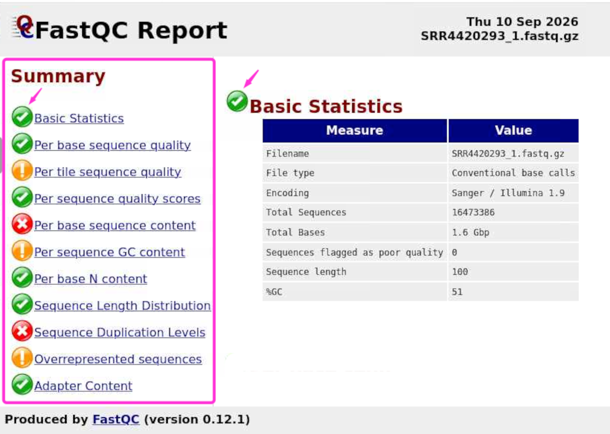

**Interpretation:** This report is for `SRR4420293_1.fastq.gz`, containing `16,473,386` reads of `100 bp` and `51%` GC. No reads are flagged as poor quality, and the values provide a baseline for comparing the other reports.

</div>


<div id="fastqc-module-per-base-quality" class="accordion_content" markdown="1" hidden>

Shows the Phred quality distribution across all sample reads at each read position. 
- The **x-axis** shows read position from the `5' end` on the left to the `3' end` on the right. 
- The **y-axis** shows the Phred quality score. 
  - The background bands indicate: green - high, yellow - moderate, red - low quality. 

At each position:
- the red line is the median across reads, 
- the blue line is the mean, 
- the yellow box contains the middle 50% of scores, and 
- the whiskers show the wider spread. 

Typical patterns:
- Quality remains high at all positions in the read: no broad quality concern.
- Quality decreases toward the `3' end`: later bases are less reliable, often because the sequencing signal weakens; substantial decline may support `3'` quality trimming.
- Quality is low across most positions: investigate the sample and consider read filtering rather than end trimming.
- A narrow dip at specific positions: check whether it is consistent across samples and mates before taking action.


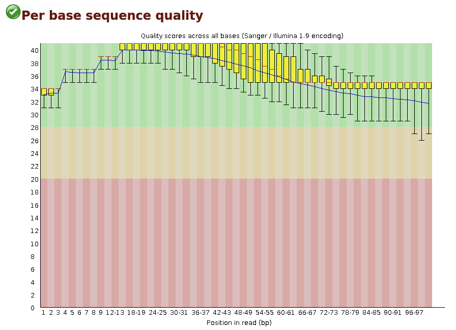

**Interpretation:** *Quality remains high across the read length, with a gradual decline and wider spread toward the `3' end`. Most scores remain in the green range, so this plot alone does not justify quality trimming or filtering.*

</div>


<div id="fastqc-module-per-tile-quality" class="accordion_content" markdown="1" hidden>

Detects whether particular flow-cell tiles have unusually low quality.
- The **x-axis** shows read position; the **y-axis** lists flow-cell tiles.
- Colors show how much each tile's quality differs from the average at that position; blue is close to average, while warmer colors indicate lower quality.

Typical patterns:
- Uniform blue: no tile-specific quality problem.
- A horizontal or localized warm-colored pattern: a flow-cell or imaging issue affecting particular tiles or cycles.

Compare the pattern across samples and mates to determine whether it is run-wide or sample-specific. Small, isolated signals are usually documented but not acted on. Strong tile-specific problems affecting many samples or a substantial fraction of one sample require investigation and may justify tile-based read filtering using tile identifiers in the read headers—not ordinary trimming.

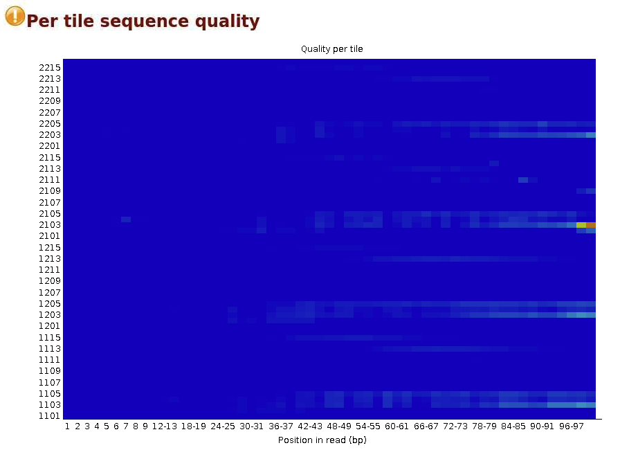

**Interpretation:** *Most of the plot is close to average, but several tiles show lower quality toward the `3' end`. This localized signal should be checked across samples and mates; unless it affects a substantial fraction of reads, it usually does not require action.*

</div>


<div id="fastqc-module-per-sequence-quality" class="accordion_content" markdown="1" hidden>

Shows the distribution of mean quality scores across reads.
- The **x-axis** shows the mean Phred quality score for each read.
- The **y-axis** shows the number of reads with each mean score.

Typical patterns:
- A narrow peak at high scores: most reads have consistently good quality.
- A broad distribution or a second low-quality peak: a substantial group of reads may need investigation or filtering.

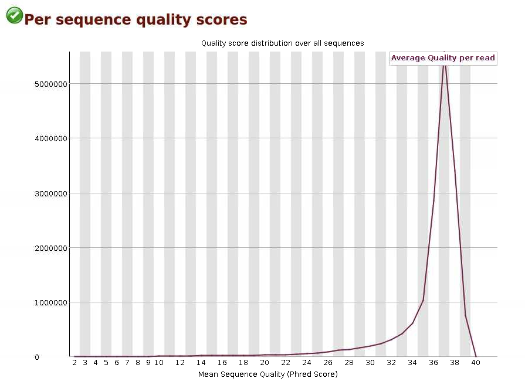

**Interpretation:** *The distribution peaks near a mean quality score of `Q37`, with relatively few reads below `Q30`. The sample therefore has a predominantly high-quality read population; this module alone does not support broad read filtering.*

</div>


<div id="fastqc-module-base-content" class="accordion_content" markdown="1" hidden>

Shows the proportion of A, C, G, and T at each position.
- The **x-axis** shows read position. 
- The **y-axis** shows the percentage of base type observed at that position across all reads in the sample.
- Each colored line shows one base; the four percentages should total approximately 100% at each position.

Typical patterns:
- After the first few positions, the four base percentages become relatively stable. This is common in libraries made from randomly fragmented molecules.
- Strong or persistent separation between base lines: may reflect primers, amplicons, targeted libraries, other non-random starts, or technical bias. Interpret it using the library design; do not trim solely to make the plot look uniform.

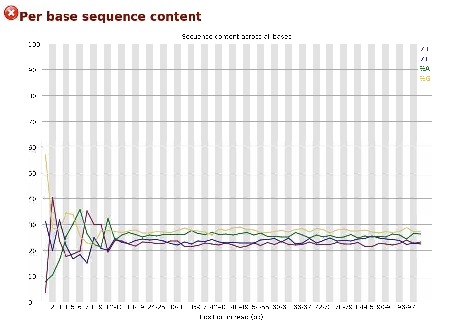

**Interpretation:** *The first several positions show strong base imbalance, but the lines stabilize near 25% after about position 12. Check whether primers or another library-specific sequence explains it; do not trim these bases unless required by the library design or downstream analysis.*

</div>


<div id="fastqc-module-gc-content" class="accordion_content" markdown="1" hidden>

Compares the observed GC distribution with an expected model.
- The **x-axis** shows the GC percentage of each read; the **y-axis** shows the number of reads.
- The observed distribution is compared with the theoretical model curve.

Typical patterns:
- A single observed peak close to the model: broadly consistent GC composition.
- A shifted, broad, multi-modal distribution, or has an unexplained additional peak: may reflect real biology, targeted or mixed libraries, contamination, or technical bias. Compare samples and use other evidence before treating it as a cleanup problem.

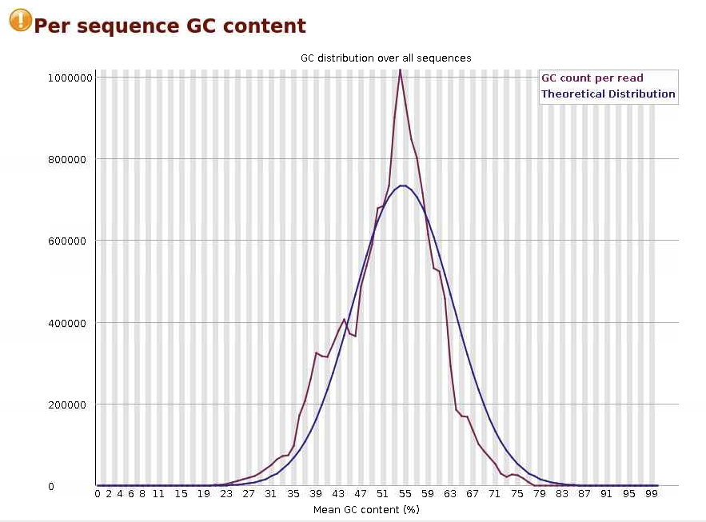

**Interpretation:** *The observed distribution peaks around `55%` GC and is broader and slightly shifted relative to the theoretical curve. If other samples show a similar profile, it likely reflects the library's biology and needs no corrective action. If this sample is an outlier, investigate contamination or a mixed library before considering filtering.*

</div>


<div id="fastqc-module-n-content" class="accordion_content" markdown="1" hidden>

Reports positions containing undetermined bases.
- The **x-axis** shows read position.
- The **y-axis** shows the percentage of reads containing an `N` at that position.

Typical patterns:
- A line at or near 0%: few or no undetermined bases.
- A high or position-specific rate: may indicate poor basecalling or low signal and can reduce usable read quality. Confirm whether it is isolated to particular samples or read ends.

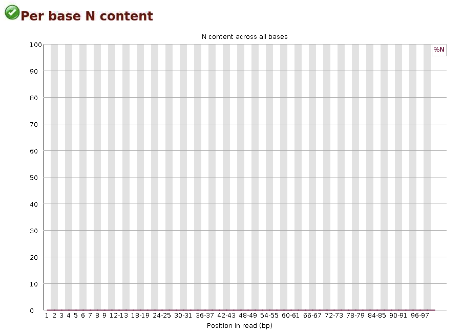

**Interpretation:** *The N content remains at approximately `0%` across all read positions. Undetermined bases are not a concern for this sample, so this module does not support N-based filtering.*

</div>


<div id="fastqc-module-length" class="accordion_content" markdown="1" hidden>

Shows the lengths of reads in the input.
- The **x-axis** shows read length; the **y-axis** shows the number of reads with each length.

Typical patterns:
- A narrow peak at the expected length: normal for fixed-length reads.
- A broad or unexpected distribution: may reflect library construction, preprocessing, or mixed inputs. Do not remove reads just because their lengths differ without a project requirement.

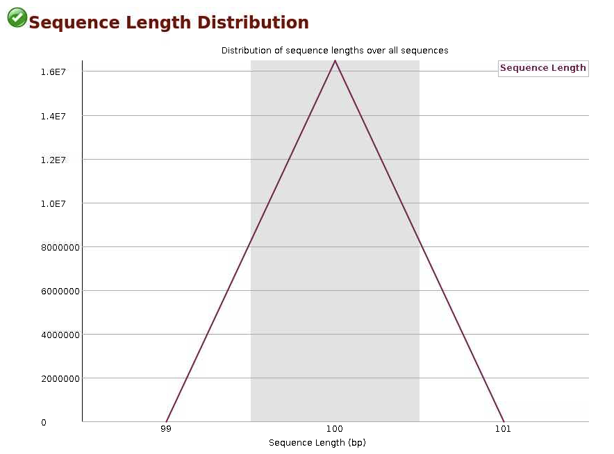

**Interpretation:** *Nearly all reads are `100 bp`, with only a few at `99` or `101 bp`. This is the expected narrow distribution for the dataset and does not indicate a length-related problem.*

</div>


<div id="fastqc-module-duplication" class="accordion_content" markdown="1" hidden>

Estimates repeated sequences.
- The **x-axis** shows how many times a sequence is repeated. 
- The **y-axis** shows the percentage of sequences at each duplication level.
- The report also estimates the percentage of sequences remaining after deduplication.

Typical patterns:
- Most sequences occurring once or a few times: lower duplication.
- A large fraction occurring many times: may result from PCR amplification, highly abundant transcripts, targeted sequencing, or low library complexity. It is not automatically contamination and is not fixed by ordinary adapter trimming.

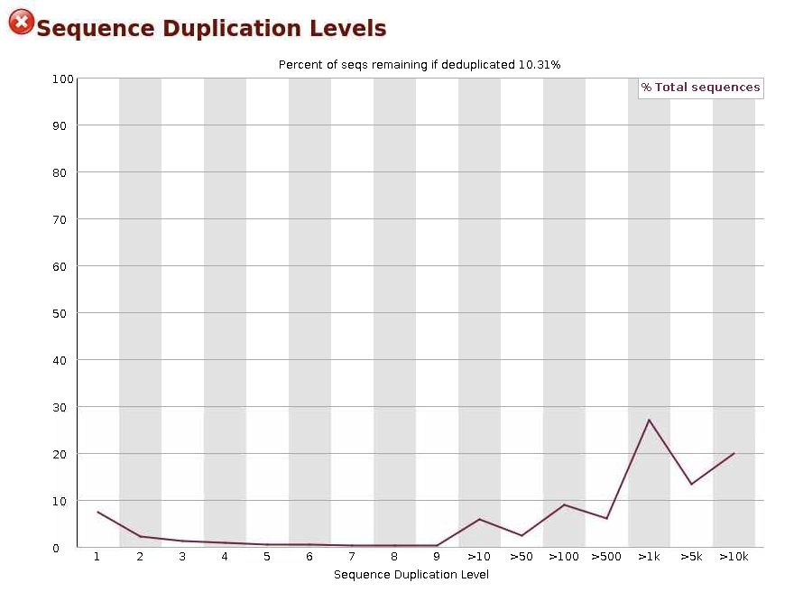

**Interpretation:** *Only `10.31%` of sequences would remain after deduplication, so most sequences are repeated. In RNA-seq, this may reflect highly abundant transcripts rather than PCR artifacts. Do not deduplicate based on this plot alone; compare samples and investigate if one sample is an outlier.*

</div>


<div id="fastqc-module-overrepresented" class="accordion_content" markdown="1" hidden>

Lists sequences occurring more often than expected.
- The table reports each sequence, its count, its percentage of reads, and a possible source when one is recognized.

Typical patterns:
- FastQC lists sequences found in more than `0.1%` of reads; more than `1%` triggers a failure. These are FastQC reporting thresholds, not universal contamination thresholds.
- Recognized adapter, primer, or contaminant sequences: investigate the source and consider the corresponding preprocessing or screening step.
- Abundant biological sequences or sequences with no identified source: interpret them using the experimental design; overrepresentation alone does not prove contamination.

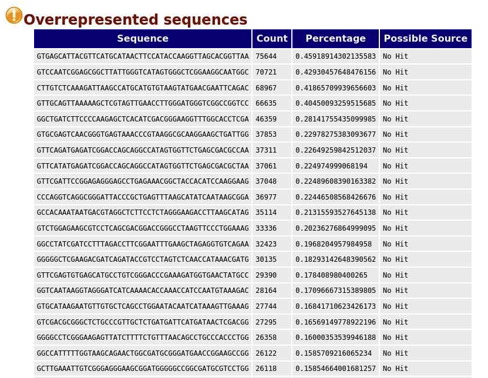

**Interpretation:** *The most frequent listed sequence occurs in about `0.46%` of reads. This is above FastQC's `0.1%` reporting threshold but below its `1%` failure threshold. FastQC identifies no known source for the listed sequences, so this result does not by itself indicate contamination or require trimming; investigate further only if the same sequences recur across samples or match a known adapter, primer, or contaminant.*

</div>


<div id="fastqc-module-adapter" class="accordion_content" markdown="1" hidden>

Shows adapter sequence representation by read position.
- The **x-axis** shows read position from the `5'` end on the left to the `3'` end on the right.
- The **y-axis** shows the percentage of reads containing each adapter sequence.

Typical patterns:
- Lines near 0%: little or no detectable adapter content.
- A rise toward the `3' end`, on the right side of the plot: adapter sequence may remain in the reads and adapter trimming may be justified. Confirm the adapter identity and check whether the pattern occurs across mates and samples.

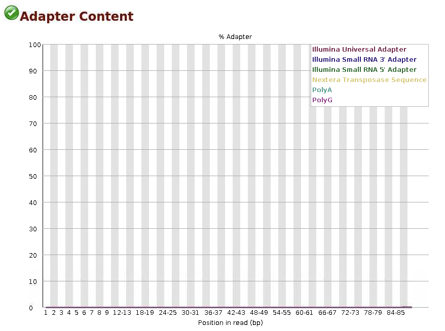

**Interpretation:** *All adapter-content lines remain near `0%` across the read. This sample shows no detectable adapter contamination, so adapter trimming is not indicated by this module.*

</div>

</div>

At the end of this review, record which results are consistent across the project, which are mate-specific, and which are isolated outliers. Use that evidence in the next sections to decide whether trimming or another preprocessing step is justified.




### 4. Extract numerical data from ZIP

FastQC automatically saves the numerical data used to create each report in `fastqc_data.txt` inside the ZIP archive. This optional step supports programmatic validation when exact values, custom statistics, or tailored plots are needed. For multi sample projects, the more common approach is to combine all sample reports with `MultiQC` for an integrated project-wide overview.

List the archive contents for selected sample:

```bash
unzip -l SRR4420293_1_fastqc.zip
```
<details class="padding-x-2 bg-success-lighter"><summary><i>command log</i></summary>

<pre><small>    56696  SRR4420293_1_fastqc/Images/per_base_quality.svg
    51808  SRR4420293_1_fastqc/Images/per_base_quality.png
   301015  SRR4420293_1_fastqc/Images/per_tile_quality.svg
    26268  SRR4420293_1_fastqc/Images/per_tile_quality.png
     9118  SRR4420293_1_fastqc/Images/per_sequence_quality.svg
    55215  SRR4420293_1_fastqc/Images/per_sequence_quality.png
    26167  SRR4420293_1_fastqc/Images/per_base_sequence_content.svg
    80383  SRR4420293_1_fastqc/Images/per_base_sequence_content.png
    26004  SRR4420293_1_fastqc/Images/per_sequence_gc_content.svg
    89910  SRR4420293_1_fastqc/Images/per_sequence_gc_content.png
    11985  SRR4420293_1_fastqc/Images/per_base_n_content.svg
    48359  SRR4420293_1_fastqc/Images/per_base_n_content.png
     3183  SRR4420293_1_fastqc/Images/sequence_length_distribution.svg
    23824  SRR4420293_1_fastqc/Images/sequence_length_distribution.png
     6340  SRR4420293_1_fastqc/Images/duplication_levels.svg
    31771  SRR4420293_1_fastqc/Images/duplication_levels.png
    32219  SRR4420293_1_fastqc/Images/adapter_content.svg
    43942  SRR4420293_1_fastqc/Images/adapter_content.png
      562  SRR4420293_1_fastqc/<b>summary.txt</b>
   661660  SRR4420293_1_fastqc/<b>fastqc_report.html</b>
   129637  SRR4420293_1_fastqc/<b>fastqc_data.txt</b>
    27728  SRR4420293_1_fastqc/fastqc.fo
</small></pre>
</details>

The most useful files are:

- `summary.txt`: one-line status for every module;
- `fastqc_data.txt`: numerical values used for generating the report plots;
- `fastqc_report.html`: the visual report stored inside the archive;
- `Images/`: PNG/SVG plots used by the HTML report.

For a quick command-line extraction of all numerical data to standard output:
```bash
unzip -p SRR4420293_1_fastqc.zip SRR4420293_1_fastqc/fastqc_data.txt | less
```
<details class="padding-x-2 bg-success-lighter"><summary><i>command log</i></summary>

<pre><small>##FastQC        0.12.1
>><b>Basic Statistics</b>      pass
#Measure        Value
Filename        SRR4420293_1.fastq.gz
File type       Conventional base calls
Encoding        Sanger / Illumina 1.9
Total Sequences 16473386
Total Bases     1.6 Gbp
Sequences flagged as poor quality       0
Sequence length 100
%GC     51
>>END_MODULE
...<i>(and following modules)</i>
>>Per base sequence quality     pass
>>Per tile sequence quality     warn
>>Per sequence quality scores   pass
>>Per base sequence content     fail
>>Per sequence GC content       warn
>>Per base N content    pass
>>Sequence Length Distribution  pass
>>Sequence Duplication Levels   fail
>>Overrepresented sequences     warn
>>Adapter Content       pass
</small></pre>
</details>

To print the selected module header plus the next three lines to learn the data structure:
```bash
unzip -p SRR4420293_1_fastqc.zip SRR4420293_1_fastqc/fastqc_data.txt | grep -A 3 '^>>Per base sequence content' 
```
<pre><small>>>Per base sequence content     fail
#Base   G       A       T       C
1       57.041966168362144      8.017770452482235       3.7818430226914104      31.158420356464212
2       28.841507896167734      10.563066537218408      40.46511043440745       20.130315132206412
</small></pre>
or, to extract all numerical values for a given module:
```bash
unzip -p SRR4420293_1_fastqc.zip SRR4420293_1_fastqc/fastqc_data.txt |
    awk '/^>>Per base sequence content/{show=1} show; show && /^>>END_MODULE/{exit}' 
```
This lets you reuse FastQC module data for custom statistics or plots.


</div>


### Compare read pairs and sample patterns

Compare the two mates within each sample first, then compare the same module across all samples.




For the arabidopsis_PRJNA348194 dataset, duplication and base-composition issues occur in both mates across all samples, while GC-content and overrepresented-sequence results affect only selected mates or samples, as shown in [Count the QC status flags](#count-the-qc-status-flags). Compare QC modules across HTML reports to decide whether one consistent preprocessing strategy is appropriate or whether an outlier needs separate investigation.

<details markdown="1"><summary>SOLUTION</summary>

<div class="usa-accordion">

<div id="exercise-gc-comparison" class="accordion_content" markdown="1" hidden>

Start by opening the reports for mates `_1` and `_2` of sample `SRR4420293`. In both reports, navigate to the **Per sequence GC content** plot:

| `SRR4420293_1` | `SRR4420293_2` |
| --- | --- |
| 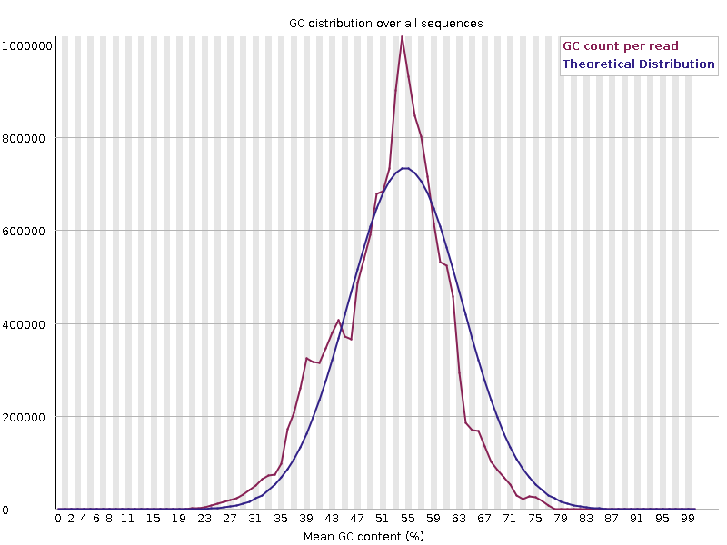 | 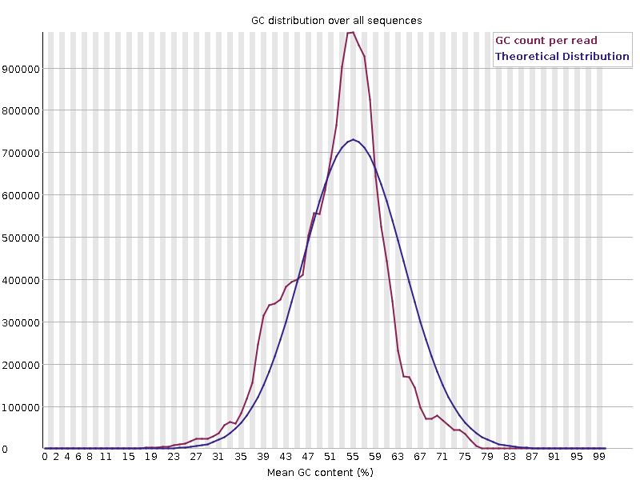 |

*Both distributions peak near `55%` GC and look broadly similar. The different FastQC statuses (`WARN` for read 1 and `FAIL` for read 2) are not visually obvious in this pair, so they do not by themselves indicate a major mate-specific problem.*



No sample in this dataset receives `PASS` for this module. So, let's compare the best-fitting `WARN` example, `SRR4420294_2`, with another `FAIL` outlier `SRR4420296_2`:

| `SRR4420294_2` | `SRR4420296_2` |
| --- | --- |
| 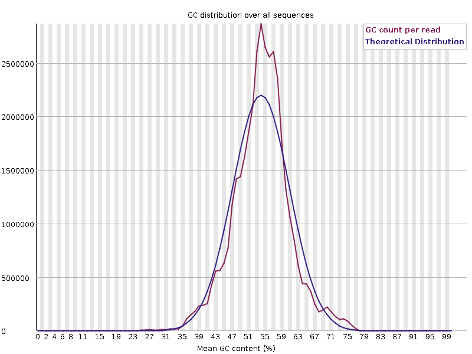 | 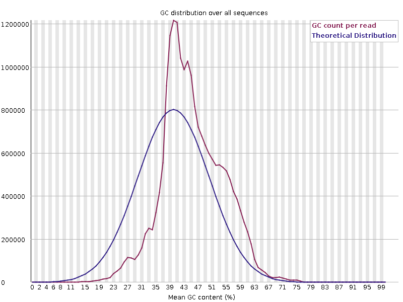 |

*The `SRR4420294_2` curve broadly follows the theoretical distribution, with modest local deviations. In contrast, `SRR4420296_2` has a strong narrow peak around `40–45%` GC and a separate shoulder near `55%`, departing substantially from the theoretical curve. The lack of any PASS result indicates that some deviation from the theoretical GC model is common in this dataset. Because most profiles are similar, this likely reflects library composition; it does not mean that the reads are low quality.*

</div>
</div>

<div class="usa-accordion">

<div id="exercise-overrepresented-comparison" class="accordion_content" markdown="1" hidden>

Next, open the **Overrepresented sequences** tables for the `FAIL` reports `SRR4420296_1` and `SRR4420296_2` and compare the top sequence, its percentage, and the reported possible source:

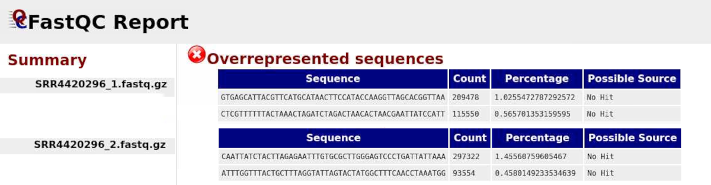

The top sequence in `SRR4420296_1` exceeds FastQC's `1%` failure threshold. The top sequence in the corresponding `SRR4420296_2` report is different. Combined with the `No Hit` source and near-zero Adapter Content, they provide no evidence of adapter contamination. 

Because this is transcriptomic data, the relevant follow-up is to check whether the sequences match abundant Arabidopsis transcripts and whether the pattern recurs in the other mate and samples. 
- A biological match or project-wide recurrence supports retaining the reads. 
- A contaminant match confined to one sample would support sample filtering.

FastQC lists `63` overrepresented sequences for `SRR4420296_1` and `43` for `SRR4420296_2`. Ideally, all listed sequences should be checked when diagnosing the overrepresentation, grouping overlapping or near-identical sequences as one pattern. However, the top sequence is useful for initial screening.

<details markdown="1"><summary>Quick command-line check</summary>

The following code extracts the top sequence from `SRR4420296` reports and checks for exact matches in every FastQC ZIP archive:

```bash
TARGET_SAMPLE="SRR4420296"      # EDIT: Enter the sample ID without the mate suffix, for example: SRR4420296
REPORT_DIR="{{ page.tutorial.root_practice }}/{{ page.tutorial.workdir }}/{{ page.tutorial.output_dir }}"
MATCHES="overrepresented_sequence_matches.tsv"

top_sequence() {
    archive="$1"
    report_name=$(basename "$archive" .zip)

    unzip -p "$archive" "${report_name}/fastqc_data.txt" |
        awk '
            /^>>Overrepresented sequences/ { in_module=1; next }
            in_module && /^>>END_MODULE/ { exit }
            in_module && $1 !~ /^#/ && NF { print $1; exit }
        '
}

seq_1=$(top_sequence "${REPORT_DIR}/${TARGET_SAMPLE}_1_fastqc.zip")
seq_2=$(top_sequence "${REPORT_DIR}/${TARGET_SAMPLE}_2_fastqc.zip")

printf 'report\tquery\tcount\tpercentage\tpossible_source\n' > "$MATCHES"

for archive in "${REPORT_DIR}"/*_fastqc.zip; do
    report_name=$(basename "$archive" .zip)

    unzip -p "$archive" "${report_name}/fastqc_data.txt" |
        awk -v report="$report_name" \
            -v q1="$seq_1" -v q2="$seq_2" \
            -v q1_label="${TARGET_SAMPLE}_1" -v q2_label="${TARGET_SAMPLE}_2" '
            BEGIN { in_module=0; found1=0; found2=0 }
            /^>>Overrepresented sequences/ { in_module=1; next }
            in_module && /^>>END_MODULE/ { exit }
            in_module && $1 !~ /^#/ && NF {
                source=$4
                for (i=5; i<=NF; i++) source=source " " $i
                if ($1 == q1) {
                    printf "%s\t%s\t%s\t%s\t%s\n", report, q1_label, $2, $3, source
                    found1=1
                }
                if ($1 == q2) {
                    printf "%s\t%s\t%s\t%s\t%s\n", report, q2_label, $2, $3, source
                    found2=1
                }
            }
            END {
                if (!found1) printf "%s\t%s\tNO_MATCH\t-\t-\n", report, q1_label
                if (!found2) printf "%s\t%s\tNO_MATCH\t-\t-\n", report, q2_label
            }
        ' >> "$MATCHES"
done

column -t -s $'\t' "$MATCHES"
```

`NO_MATCH` means that FastQC did not list that exact sequence in the report; it does not prove that the sequence is absent from the reads. The table shows whether either sequence recurs across samples and mates, and whether its abundance is isolated to the selected sample.

<pre><small>report               query         count     percentage           possible_source
SRR4420293_1_fastqc  SRR4420296_1  75644     0.45918914302135583  No Hit
SRR4420293_1_fastqc  SRR4420296_2  NO_MATCH  -                    -
SRR4420293_2_fastqc  SRR4420296_2  71668     0.43505324284879865  No Hit
SRR4420293_2_fastqc  SRR4420296_1  NO_MATCH  -                    -
SRR4420294_1_fastqc  SRR4420296_1  NO_MATCH  -                    -
SRR4420294_1_fastqc  SRR4420296_2  NO_MATCH  -                    -
SRR4420294_2_fastqc  SRR4420296_1  NO_MATCH  -                    -
SRR4420294_2_fastqc  SRR4420296_2  NO_MATCH  -                    -
SRR4420295_1_fastqc  SRR4420296_1  86108     0.5395428422694359   No Hit
SRR4420295_1_fastqc  SRR4420296_2  NO_MATCH  -                    -
SRR4420295_2_fastqc  SRR4420296_2  85884     0.5381392839860203   No Hit
SRR4420295_2_fastqc  SRR4420296_1  NO_MATCH  -                    -
SRR4420296_1_fastqc  SRR4420296_1  209478    1.0255472787292572   No Hit
SRR4420296_1_fastqc  SRR4420296_2  NO_MATCH  -                    -
SRR4420296_2_fastqc  SRR4420296_2  297322    1.45560759605467     No Hit
SRR4420296_2_fastqc  SRR4420296_1  NO_MATCH  -                    -
SRR4420297_1_fastqc  SRR4420296_1  79202     0.37119863762291894  No Hit
SRR4420297_1_fastqc  SRR4420296_2  NO_MATCH  -                    -
SRR4420297_2_fastqc  SRR4420296_2  84215     0.3946932308201071   No Hit
SRR4420297_2_fastqc  SRR4420296_1  NO_MATCH  -                    -
SRR4420298_1_fastqc  SRR4420296_1  47209     0.20946191594671204  No Hit
SRR4420298_1_fastqc  SRR4420296_2  NO_MATCH  -                    -
SRR4420298_2_fastqc  SRR4420296_2  57767     0.25630677410014435  No Hit
SRR4420298_2_fastqc  SRR4420296_1  NO_MATCH  -                    -
</small></pre>

*Both sequences recur in the same mate across five of six samples, indicating a shared mate-specific pattern, not contamination unique to SRR4420296. Retain these reads.*

</details>


</div>
</div>

<div class="usa-accordion">

<div id="exercise-base-content-comparison" class="accordion_content" markdown="1" hidden>

The comparison of **Per base sequence content** plots across all six samples shows the same pattern in all `12` reports: the first positions are strongly biased, then the four base percentages move broadly closer to `25%` each. 

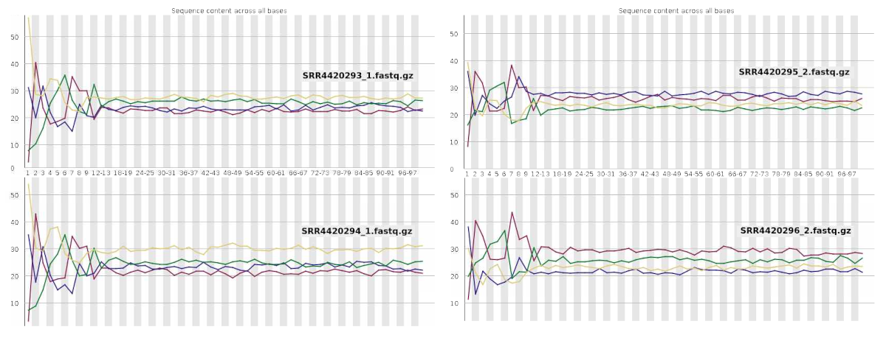

Here, the bias is concentrated at the read start and shared across all samples and mates, so it is most consistent with a systematic library or priming effect rather than sample-specific read damage. A composition bias alone will not reduce alignment quality; and because it is shared across samples, it is unlikely to create a sample-specific quantification artifact. Therefore, do not trim the first bases: they will not improve read quality and clipping them would only shorten usable reads.
</div>
</div>

<div class="usa-accordion">

<div id="exercise-duplication-comparison" class="accordion_content" markdown="1" hidden>

All `12` reports receive `FAIL`, but the duplication level differs between samples.  
The following command extracts the deduplicated percentage and the highest duplication-level bin from every FastQC ZIP archive:
```bash
REPORT_DIR="{{ page.tutorial.root_practice }}/{{ page.tutorial.workdir }}/{{ page.tutorial.output_dir }}"
SUMMARY="duplication_summary.tsv"

printf 'report\tstatus\tdeduplicated [%]\tduplicated [%]\tmore_than_10000_copies [%]\n' > "$SUMMARY"

for archive in "${REPORT_DIR}"/*_fastqc.zip; do
    report_name=$(basename "$archive" .zip)

    unzip -p "$archive" "${report_name}/fastqc_data.txt" |
        awk -F '\t' -v report="$report_name" '
            /^>>Sequence Duplication Levels/ { status=$2; in_module=1; next }
            in_module && /^#Total Deduplicated Percentage/ { dedup=$2 }
            in_module && $1 == ">10k+" { over_10000=$2 }
            in_module && /^>>END_MODULE/ {
                printf "%s\t%s\t%.2f\t%.2f\t%.2f\n", report, status, dedup, 100-dedup, over_10000
                exit
            }
        ' >> "$SUMMARY"
done

column -t -s $'\t' "$SUMMARY"
```

<pre><small>report               status  deduplicated [%]  duplicated [%]  more_than_10000_copies [%]
SRR4420293_1_fastqc  fail    10.31                 89.69               20.02
SRR4420293_2_fastqc  fail    14.82                 85.18               9.27
<b>SRR4420294_1_fastqc  fail    4.82                  95.18               50.30</b>
<b>SRR4420294_2_fastqc  fail    8.41                  91.59               39.67</b>
SRR4420295_1_fastqc  fail    11.11                 88.89               17.18
SRR4420295_2_fastqc  fail    16.26                 83.74               8.29
SRR4420296_1_fastqc  fail    17.57                 82.43               18.48
SRR4420296_2_fastqc  fail    22.05                 77.95               14.92
SRR4420297_1_fastqc  fail    9.68                  90.32               25.08
SRR4420297_2_fastqc  fail    14.16                 85.84               14.02
SRR4420298_1_fastqc  fail    9.86                  90.14               21.27
SRR4420298_2_fastqc  fail    13.99                 86.01               11.85
</small></pre>

`SRR4420294` is the clear outlier: only `4.82%` of read 1 and `8.41%` of read 2 sequences remain after deduplication, and `50.30%` and `39.67%` of sequences occur more than `10,000` times. The other samples retain approximately `10–22%` after deduplication, with only `9–25%` in the `>10,000` category.

High duplication is present across the dataset. In transcriptomic dataset like this, abundant transcripts can produce genuine repeated reads, so the duplication pattern alone does not distinguish biological abundance from PCR amplification. Deduplicating the reads could remove valid expression signal. For `SRR4420294`, the signal appears in both mates, so it may reflect sample-level transcript abundance. Therefore, do not deduplicate or exclude this sample based on FastQC duplication status alone; flag `SRR4420294` and check the mapping in the later steps: reads matching expressed Arabidopsis transcripts support biological duplication, while rRNA, contaminants, or low-complexity matches indicate an unwanted library component.

</div>
</div>

</details>




### Decide on the next preprocessing step

The FastQC module analysis leads to these conclusions:

- The per-base quality, adapter-content, and N-content plots show no broad quality, adapter, or ambiguous-base problem; routine quality or adapter trimming and N-based filtering should not be applied.
- The early base-composition imbalance is consistent across the reports and stabilizes after the first several positions. It is more consistent with library-specific sequence composition than with a trimming problem, so those bases should not be removed.
- The duplication plots show many repeated sequences across the transcriptomic samples. This can reflect abundant transcripts; deduplicate only when library metadata or UMI analysis indicates PCR duplication.
- The GC-content differences and the overrepresented sequences in `SRR4420296` need review of their sequence identities and sample metadata before any sample-specific filtering.
- Tile `2103` has severe quality loss in read 1 across all samples, while read 2 passes. Check the raw FASTQ files by extracting tile IDs from read headers and summarizing their Phred scores. If scores for this tile are consistently lower across read positions, filter those read pairs from both mates.

</div>


## Summary

This tutorial uses `FastQC` to assess raw paired-end reads before downstream RNA-seq analysis. Compare QC results across samples and mates to decide whether trimming, filtering, or deduplication is justified.
