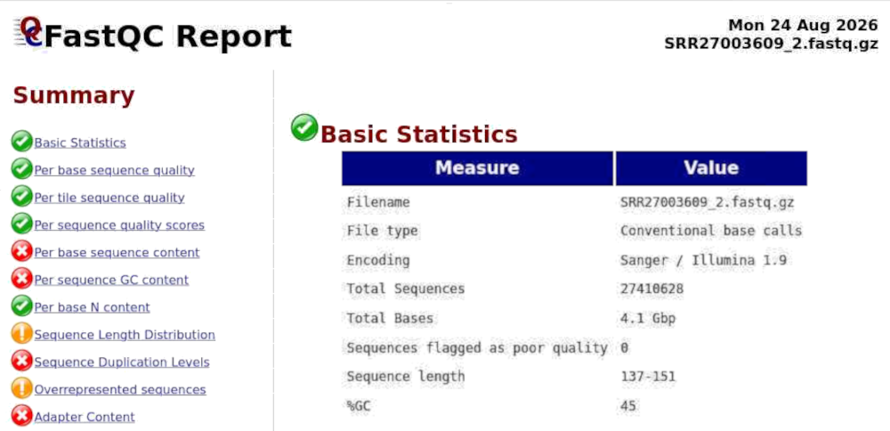
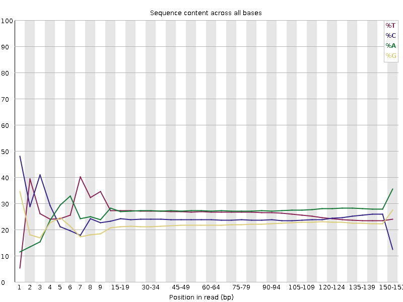
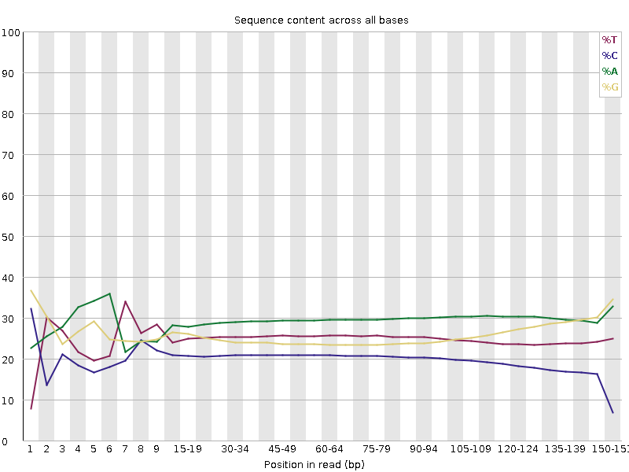
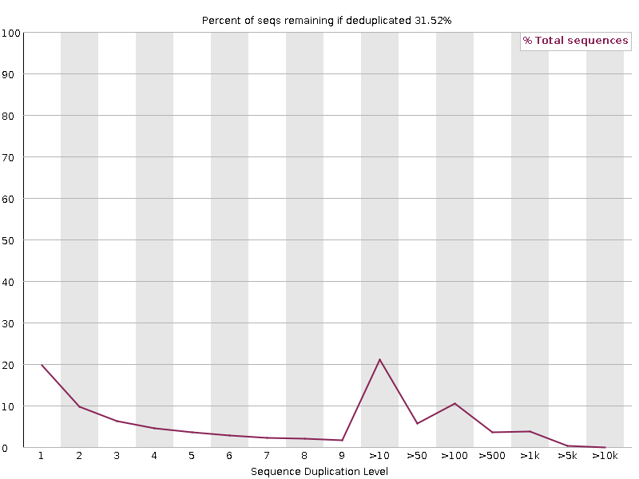
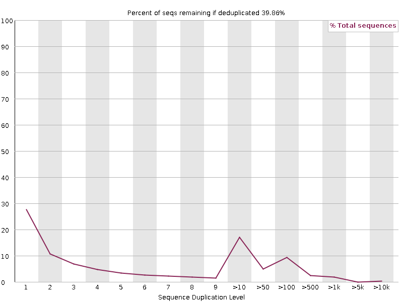
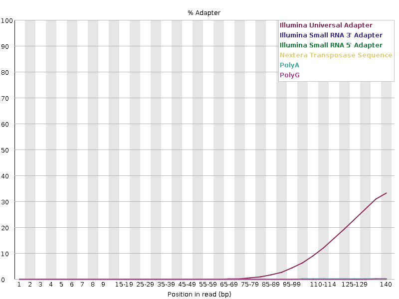
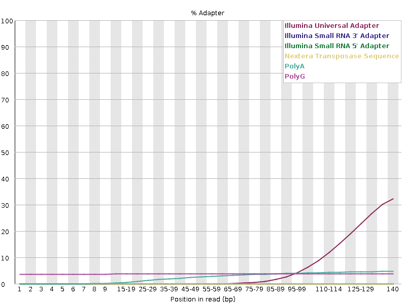
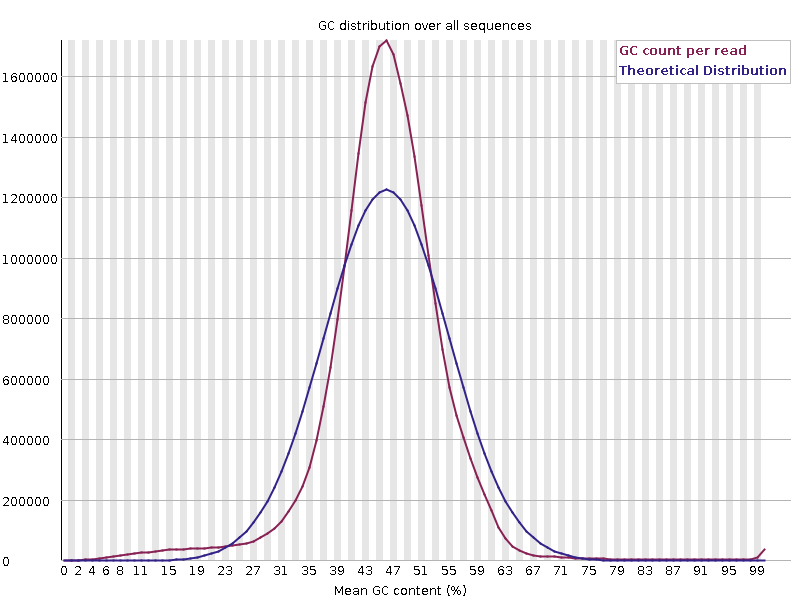
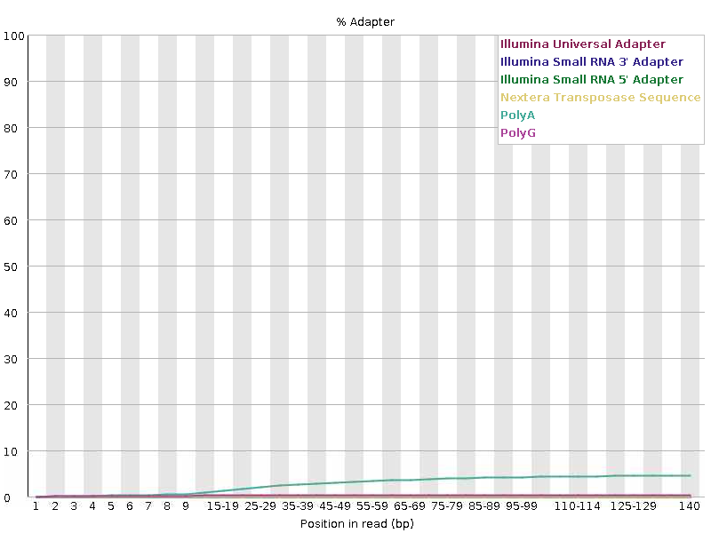

## Overview

This tutorial uses a separate nine-sample **Arabidopsis transcriptomic dataset**, `PRJNA1047140` (PFOS treatment), to demonstrate BBDUK trimming of Illumina adapter carryover and terminal poly-G signal identified by FastQC.
You will validate the cleaned reads and avoid filtering shared transcriptomic composition or duplication patterns.



## Getting Started



**Tutorial Steps:**
1. [Prepare the practice workspace](#prepare-the-practice-workspace) and inspect the input set for the cleanup task.
1. [Get the dataset](#get-the-dataset) and confirm how you will access the raw reads.
1. [Decide what should be removed](#decide-what-should-be-removed) from prior QC evidence.
1. [Run BBDUK on the Arabidopsis reads](#run-bbduk-on-the-arabidopsis-reads) with appropriate k-mer settings for adapters or contaminants.
1. [Inspect the trimmed reads](#inspect-the-trimmed-reads) and logs to see what changed.
1. [Validate the cleanup with follow-up QC](#validate-the-cleanup-with-follow-up-qc) and decide whether the dataset improved enough for downstream use.

## Tutorial Steps

<div class="process-list" markdown='1'>

### Prepare the practice workspace



### Get the dataset



<pre><small>total 28G
SRR27003605_1.fastq.gz  SRR27003606_1.fastq.gz  SRR27003607_1.fastq.gz
SRR27003605_2.fastq.gz  SRR27003606_2.fastq.gz  SRR27003607_2.fastq.gz
SRR27003608_1.fastq.gz  SRR27003609_1.fastq.gz  SRR27003610_1.fastq.gz
SRR27003608_2.fastq.gz  SRR27003609_2.fastq.gz  SRR27003610_2.fastq.gz
SRR27003611_1.fastq.gz  SRR27003612_1.fastq.gz  SRR27003613_1.fastq.gz
SRR27003611_2.fastq.gz  SRR27003612_2.fastq.gz  SRR27003613_2.fastq.gz
</small></pre>

In this tutorial, those reads are used as a realistic case for deciding whether adapter-only cleanup is enough or whether k-mer-based contaminant filtering is justified.

### Decide what should be removed

Before choosing what to remove:

<div class="usa-accordion">

<div id="bbduk-fastqc-quick-path" class="accordion_content" markdown="1" hidden>



Set the `QC_RESULTS` path:
```bash
QC_RESULTS={{ page.tutorial.qc_results }}
```
</div>

<b class="margin-left-2">or</b>

<div id="bbduk-fastqc-step-by-step" class="accordion_content" markdown="1" hidden>

Set a workdir for read quality checking:
```bash
QC_RESULTS=/90daydata/shared/$USER/tutorials/short_reads_trim/fastqc
mkdir -p "${QC_RESULTS}"
```

Create the script file:
```bash
nano "${QC_RESULTS}"/fastqc_batch.sh
```
<details markdown="1"><summary><i>copy-paste the script</i></summary>

```bash
#!/bin/bash
#SBATCH --job-name=fastqc_prjna1047140
#SBATCH --partition=<value>                 # EDIT: Ceres: ceres or scavenger; Atlas: atlas
#SBATCH --nodes=1
#SBATCH --ntasks=1
#SBATCH --cpus-per-task=12                  # EDIT: one CPU for each FASTQ file; up to 72-96 on Ceres; up to 48 on Atlas
#SBATCH --account=<account>                 # EDIT: specify project account
#SBATCH --mem=16G                           # EDIT: adjust with benchmark; reserve enough memory for parallel files
#SBATCH --time=00:30:00                     # EDIT: adjust with estimate for the entire dataset; add +10% buffer
#SBATCH --output=fastqc_%j.out

module load fastqc
fastqc -v

INPUT_DIR="{{ page.tutorial.data_path }}"
OUTDIR="{{ page.tutorial.qc_results_user }}"
mkdir -p "${OUTDIR}"

fastqc --threads "${SLURM_CPUS_PER_TASK}" --outdir "${OUTDIR}" "${INPUT_DIR}"/*.fastq.gz
```
</details>

Submit batch job and wait for it to finish:
```bash
sbatch "${QC_RESULTS}"/fastqc_batch.sh
```

</div>
</div>

#### Review QC modules

Then complete all [QC review](/bioinformatics/reads-qc/short-read/qc_fastqc#review-the-report-modules) steps, following the guide from the FastQC tutorial:

<ol>
<li markdown="1">[Check summary flags](/bioinformatics/reads-qc/short-read/qc_fastqc#1-check-summary-flags)
<details class="margin-top-0 bg-info-lighter" markdown="1"><summary><i>preview results</i></summary>

**Check that every input has both a .zip and an .html report**
<pre><small>No missing report files found.</small></pre>

**Count the QC status flags**
<pre><small>WARN 32
FAIL 56
PASS 110
</small></pre>

**List each unique module with a FAIL status**
<pre><small>module                                    FAIL_in_1  FAIL_in_2 samples_in_1                                            samples_in_2                                           
Per base sequence content                         9          9 SRR27003605,SRR27003606,SRR27003607,SRR27003608,SRR27003609,SRR27003610,SRR27003611,SRR27003612,SRR27003613 SRR27003605,SRR27003606,SRR27003607,SRR27003608,SRR27003609,SRR27003610,SRR27003611,SRR27003612,SRR27003613
Sequence Duplication Levels                       9          9 SRR27003605,SRR27003606,SRR27003607,SRR27003608,SRR27003609,SRR27003610,SRR27003611,SRR27003612,SRR27003613 SRR27003605,SRR27003606,SRR27003607,SRR27003608,SRR27003609,SRR27003610,SRR27003611,SRR27003612,SRR27003613
Adapter Content                                   9          9 SRR27003605,SRR27003606,SRR27003607,SRR27003608,SRR27003609,SRR27003610,SRR27003611,SRR27003612,SRR27003613 SRR27003605,SRR27003606,SRR27003607,SRR27003608,SRR27003609,SRR27003610,SRR27003611,SRR27003612,SRR27003613
Per sequence GC content                           0          2                                                         SRR27003609,SRR27003611 
</small></pre> 

- ***Were reports produced for every input file?***  
  *Yes. All expected .html and .zip reports are present.*
- ***Do the paired reads show broadly similar module results?***  
  *Yes. Both mates fail `Sequence Duplication Levels`, `Per base sequence content`, and `Adapter Content`.*
- ***Is one sample or mate an obvious outlier that deserves detailed review?***  
  *Yes. `SRR27003609_2` and `SRR27003611_2` are the only reports with a `FAIL` for `Per sequence GC content` and deserve closer review.*
</details>
</li>

<li markdown="1">[Open HTML reports](/bioinformatics/reads-qc/short-read/qc_fastqc#2-open-html-reports)
<details class="margin-top-0 bg-info-lighter" markdown="1"><summary><i>preview steps</i></summary>

- if you run FastQC in your workspace, open: `{{ page.tutorial.qc_results_user }}`
- if you use pre-calculated results, open: `{{ page.tutorial.qc_results }}` 

---


</details>
</li>

<li markdown="1">[Review QC modules](/bioinformatics/reads-qc/short-read/qc_fastqc#3-review-qc-modules)
<details class="margin-top-0 bg-info-lighter" markdown="1"><summary><i>preview results</i></summary>



*This report shows read 2 of sample `SRR27003609`. Its summary reports `FAIL` for [Per base sequence content](/bioinformatics/reads-qc/short-read/qc_fastqc#fastqc-module-base-content), [Sequence Duplication Levels](/bioinformatics/reads-qc/short-read/qc_fastqc#fastqc-module-duplication), [Adapter Content](/bioinformatics/reads-qc/short-read/qc_fastqc#fastqc-module-adapter), and [Per sequence GC content](/bioinformatics/reads-qc/short-read/qc_fastqc#fastqc-module-gc-content), plus `WARN` for [Overrepresented sequences](/bioinformatics/reads-qc/short-read/qc_fastqc#fastqc-module-overrepresented). The first three modules fail across all samples. We will review these patterns across the dataset before deciding what to remove. The shared **Adapter Content** failure provides the clearest target for `BBDUK` adapter trimming, while additional filtering may require module-specific evidence.*

</details>
</li>

<li markdown="1">[Compare read pairs and sample patterns](/bioinformatics/reads-qc/short-read/qc_fastqc#compare-read-pairs-and-sample-patterns), especially **Adapter Content**
<details class="margin-top-0" markdown="1"><summary class="bg-info-lighter"><i>preview results</i></summary>

<div class="usa-accordion">

<div id="bbduk-base-content-comparison" class="accordion_content" markdown="1" hidden>

| `SRR27003609_1` | `SRR27003609_2` |
| --- | --- |
|  |  |

*Both mates show the same strong composition bias at the read ends (across the first `9` read positions and in the final `4`-base bin), while the middle positions are broadly balanced. Because this pattern is shared across all samples, it is consistent with library or priming composition rather than removable adapter sequence; BBDUK should not trim or filter reads for this module.*

</div>


<div id="bbduk-duplication-comparison" class="accordion_content" markdown="1" hidden>

| `SRR27003609_1` | `SRR27003609_2` |
| --- | --- |
|  |  |

*Only `31.52%` of read 1 and `39.86%` of read 2 sequences would remain after deduplication. BBDUK can remove exact duplicates with `dedupe=t`, but do not enable it here: repeated reads may represent abundant transcripts rather than technical artifacts in this transcriptomic dataset.*

</div>


<div id="bbduk-adapter-comparison" class="accordion_content" markdown="1" hidden>

| `SRR27003609_1` | `SRR27003609_2` |
| --- | --- |
|  |  |

*Both mates show a sharp rise in Illumina Universal Adapter content after approximately `90–100 bp`, reaching about `33–35%` at the read end. This failure occurs across all `18` reports, so targeted right-end adapter trimming with BBDUK is justified; whole-read filtering is not indicated by this module because it detects adapters at read ends, so trim those ends only.*

</div>


<div id="bbduk-gc-comparison" class="accordion_content" markdown="1" hidden>

| `SRR27003609_2` (`FAIL`) | `SRR27003611_2` (`FAIL`) |
| --- | --- |
|  |  |

*These are the only two GC-content failures. FastQC reports a failure when the observed GC distribution differs from its theoretical model. In RNA-seq, expressed transcripts can produce a non-random GC distribution. The observed narrow peaks near `46–47%` GC indicate shared library composition rather than a sample-specific contaminant. Therefore, this result is not a trimming or filtering target.*

</div>


<div id="bbduk-overrepresented-comparison" class="accordion_content" markdown="1" hidden>

FastQC reports one overrepresented sequence (a 50-base poly-G sequence) in eight files:

| Sample | Read | Percentage | Possible source |
| --- | --- | ---: | --- |
| `SRR27003605` | `_2` | `0.374%` | `No Hit` |
| `SRR27003606` | `_2` | `0.272%` | `No Hit` |
| `SRR27003608` | `_2` | `0.118%` | `No Hit` |
| `SRR27003609` | `_2` | `0.464%` | `No Hit` |
| `SRR27003610` | `_2` | `0.263%` | `No Hit` |
| `SRR27003611` | `_2` | `0.640%` | `No Hit` |
| `SRR27003612` | `_2` | `0.297%` | `No Hit` |
| `SRR27003613` | `_2` | `0.409%` | `No Hit` |

*The pattern is limited to read 2 and consists only of **poly-G** sequence, so it is consistent with a technical homopolymer artifact rather than a biological contaminant.*  

BBDUK supports poly-G and poly-A/T handling separately from adapter matching:
- `trimpolyg=N` : trims poly-**G** from read ends.
- `trimpolya=N` : trims poly-**A** or poly-**T** tails.
- `filterpolyg=N` : removes reads with a poly-**G** prefix.

*The `N` value is the minimum consecutive homopolymer length to trim.*



Check whether poly-G occurs at the read ends in the raw FASTQ files:

```bash
SAMPLE="{{ page.tutorial.sample }}"
DATA="{{ page.tutorial.data_path }}"
BASE="G"  # Change to A, C, or T when checking another homopolymer
HOMOPOLYMER_LENGTH=10
MAX_READS=1000000  # Use 0 to scan the complete file

printf "file\treads_checked\tat_start\tat_end\tin_middle\n"
for SUFFIX in "{{ page.tutorial.read1_suffix }}" "{{ page.tutorial.read2_suffix }}"; do
    FILE="${DATA}/${SAMPLE}${SUFFIX}"
    zcat "${FILE}" | awk -v file="$(basename "${FILE}")" \
        -v base="${BASE}" -v run_length="${HOMOPOLYMER_LENGTH}" \
        -v max_reads="${MAX_READS}" '
        BEGIN {
            target = ""
            for (i = 1; i <= run_length; i++) target = target base
        }
        NR % 4 == 2 {
            reads++
            at_start = $0 ~ ("^" target)
            at_end = $0 ~ (target "$")
            if (at_start) start++
            else if (at_end) end++
            else if (index($0, target)) middle++
            if (max_reads && reads >= max_reads) exit
        }
        END {
            printf "%s\t%d\t%d\t%d\t%d\n", file, reads, start, end, middle
        }'
done
```
*This check determines whether the sequence is at the start, at the end, or in the middle of reads. If it is at the end, add the corresponding BBDUK homopolymer-trimming option; if it occurs mainly in the middle, do not use end trimming.*

<pre><small>file              reads_checked at_start  at_end  in_middle
SRR27003609_1.fastq.gz  1000000 0         4048    57
SRR27003609_2.fastq.gz  1000000 41934     1785    1876
</small></pre>

This confirms the poly-G sequence is mainly terminal, not internal. Such result is consistent with a technical poly-G artifact in read 2. Use BBDUK’s poly-G trimming (`trimpolyg=10` to trim poly-G from either read end), not whole-read filtering (`filterpolyg`, which would discard affected reads).

</div>
</div>

</details>

</li>
</ol>

For this dataset:
- FastQC detected known **Illumina Universal Adapter** sequences at the right ends of both mates, so use BBDUK for right-end adapter trimming.
- The overrepresented sequences module reported **terminal poly-G** in read 2, and the raw-read check confirmed it; add `trimpolyg=10` when processing both mates.
- The overrepresented sequences had no contaminant-database matches; other repeated reads may represent abundant transcripts, so skip deduplication.
- FastQC provides no evidence for another contaminant that would require whole-read filtering.

Use BBDUK for **adapter trimming** and **terminal poly-G trimming** only.


### Run BBDUK on the Arabidopsis reads



<div class="usa-accordion" data-allow-multiple>

<div id="bbduk-tool-setup" class="accordion_content" markdown='1' hidden>




BBDUK requires Java runtime: 
```bash
module load java/11
```





</div>


<div id="bbduk-live-first" class="accordion_content" markdown='1' hidden>

Start with **one paired-end sample** in the interactive session. `BBDUK` is flexible and can remove very different kinds of sequence content, so the first run should confirm that the selected k-mer strategy creates non-empty outputs and removes what you intended rather than more than you intended.

For `BBDUK`, you need both the paired-end read files and a reference adapter file for k-mer matching. The main choices are the reference sequences you want to match against, the k-mer sensitivity settings, the minimum read length to retain after trimming, and how many CPU threads to use.

<div class="table-small" markdown="1">

| Option | Description | Example |
| --- | --- | --- |
| `ref=` | Reference adapter or contaminant sequences to match | `ref=adapters.fa` |
| `in1=`, `in2=` | Input paired-end `FASTQ` files | `in1=reads_1.fastq.gz`<br>`in2=reads_2.fastq.gz` |
| `out1=`, `out2=` | Output files for cleaned read 1 and read 2 | `out1=reads_1.clean.fastq.gz`<br>`out2=reads_2.clean.fastq.gz` |
| `ktrim=` | Trim mode for matched k-mers | `ktrim=r` |
| `k=` | K-mer length used for matching | `k=23` |
| `mink=` | Smaller k-mer size allowed near read ends | `mink=11` |
| `hdist=` | Allowed mismatches in k-mer matching | `hdist=1` |
| `tpe`, `tbo` | Keep paired-end trimming synchronized and use pair overlap to refine adapter trimming | `tpe tbo` |
| `qtrim=`, `trimq=` | Quality-trim read ends before length filtering | `qtrim=rl trimq=20` |
| `minlen=` | Drop reads shorter than this after cleanup | `minlen=36` |
| `threads=` | Number of CPU threads used by `BBDUK` | `threads=4` |
| `trimpolyg=` | Trim terminal poly-G runs at least this long | `trimpolyg=10` |
| `trimpolya=` | Trim terminal poly-A or poly-T runs at least this long | `trimpolya=10` |
| `filterpolyg=` | Discard reads with a poly-G prefix at least this long | `filterpolyg=10` |

</div>

### Run a command

Use one paired-end sample directly from the [dataset location](#get-the-dataset). For a first adapter and poly-G cleanup trial, use a local adapter reference file, trim adapter matches from the right end and terminal poly-G runs, and retain reads at least 36 bases long.

Before running the command, make sure you know the path to the adapter reference file you want `BBDUK` to use. `BBDUK` requires reference adapter sequences for matching and trimming, and in this example they are provided under `/software/el9/apps/bbtools/39.01/resources/` with the pre-installed `bbtools` package. For your own project, use the adapter file supplied with your sequencing kit or the adapter sequences published by the platform or library-preparation vendor:

```bash
# TOOL_PATH="/software/el9/apps/bbtools/39.01"  # Use ${TOOL_PATH}/bbduk.sh below if this directory is not already in your PATH.
# module load java/11     # Java is required; load it if Java is not already available in this session.

WORKDIR="{{ page.tutorial.root_practice }}/{{ page.tutorial.workdir }}"
OUTDIR="${WORKDIR}/bbduk_test"
mkdir -p "${OUTDIR}"
cd "${WORKDIR}"

SAMPLE="{{ page.tutorial.sample }}"
R1="{{ page.tutorial.data_path }}/${SAMPLE}{{ page.tutorial.read1_suffix }}"
R2="{{ page.tutorial.data_path }}/${SAMPLE}{{ page.tutorial.read2_suffix }}"
ADAPTERS="{{ page.tutorial.adapter_path }}"

time memory bbduk.sh \
  in1=${R1} in2=${R2} \
  out1="${OUTDIR}/${SAMPLE}{{ page.tutorial.output1_suffix }}" out2="${OUTDIR}/${SAMPLE}{{ page.tutorial.output2_suffix }}" \
  ref=${ADAPTERS} \
  ktrim=r k=23 mink=11 hdist=1 qtrim=rl trimq=20 minlen=36 tpe tbo \
  trimpolyg=10 \
  threads=4
```

<details class="padding-left-2" markdown="1"><summary><i>explanation of options</i></summary>

- `ref=adapters.fa`: Reference file containing adapter sequences to be trimmed.
- `ktrim=r`: Trim adapters from the right end of reads.
- `k=23`: K-mer length for matching adapters.
- `mink=11`: Minimum k-mer length for adapter matching.
- `hdist=1`: Allow one mismatch in k-mer matching.
- `qtrim=rl`: Trim both ends of reads based on quality.
- `trimq=20`: Quality threshold for trimming.
- `minlength=36`: Discard reads shorter than 36 bases after trimming.
- `tpe`: Trim both reads of a pair if one is trimmed.
- `tbo`: Trim adapters based on pair overlap detection.
- `trimpolyg=10`: Trim poly-G at least 10 bases long from either read end.
</details>

<details class="padding-x-2 bg-success-lighter"><summary><i>command log</i></summary>

<pre><small>Version 39.01
Set threads to 4
maskMiddle was disabled because useShortKmers=true
1.091 seconds.
Initial:
Memory: max=7000m, total=7000m, free=6982m, used=18m
Added 217135 kmers; time:       1.089 seconds.
Memory: max=7000m, total=7000m, free=6974m, used=26m
Input is being processed as paired
Started output streams: 0.802 seconds.
Processing time:                352.227 seconds.

Peak system RAM: 2.19 GB  (2140800 KiB)
real    6m4.715s
user    34m32.497s
sys     1m4.800s
</small></pre>
</details>
*This run used about 2.2 GB RAM, completed in 6 minutes with 4 CPUs.*
<pre><small>Input:                          54821256 reads          8256837883 bases.
QTrimmed:                       4421916 reads (8.07%)   210210353 bases (2.55%)
Polymer-trimmed:                1101370 reads (2.01%)   44069316 bases (0.53%)
KTrimmed:                       20979888 reads (38.27%) 754241564 bases (9.13%)
Trimmed by overlap:             3917182 reads (7.15%)   21822920 bases (0.26%)
Total Removed:                  164770 reads (0.30%)    1030344153 bases (12.48%)
Result:                         54656486 reads (99.70%) 7226493730 bases (87.52%)
Time:                           354.121 seconds.
Reads Processed:      54821k    154.81k reads/sec
Bases Processed:       8256m    23.32m bases/sec
</small></pre>

*The cleanup retained 99.7% of reads. Most removed bases came from adapter trimming (9.13%), with smaller contributions from quality (2.55%) and poly-G trimming (0.53%); only 0.30% of reads were discarded. This indicates targeted end trimming with minimal read loss.*


### Validate the output before scaling up

1. First, confirm that the filtered paired-end files were created:
```bash
ls -lh "${OUTDIR}/${SAMPLE}{{ page.tutorial.output1_suffix }}" "${OUTDIR}/${SAMPLE}{{ page.tutorial.output2_suffix }}"
```
*Both mate files should be present and non-empty.*  
    <pre><small>1.6G  SRR27003609_1.bbduk.fastq.gz
1.5G  SRR27003609_2.bbduk.fastq.gz
    </small></pre>

2. Next, confirm that the compressed filtered reads are readable and not truncated:
```bash
gzip -t "${OUTDIR}/${SAMPLE}{{ page.tutorial.output1_suffix }}" "${OUTDIR}/${SAMPLE}{{ page.tutorial.output2_suffix }}" && echo "gzip check passed"
```
    <pre><small>gzip check passed</small></pre>

3. Then compare the raw inputs and cleaned outputs with `seqkit stats`:
```bash
module load seqkit
seqkit version  # save version in the README or docs for your project
seqkit stats "${R1}" "${R2}" "${OUTDIR}/${SAMPLE}{{ page.tutorial.output1_suffix }}" "${OUTDIR}/${SAMPLE}{{ page.tutorial.output2_suffix }}"
```
   <pre><small>seqkit v2.4.0
file                                                    format  type    num_seqs        sum_len  min_len  avg_len  max_len
/reference/.../00_raw_data/SRR27003609_1.fastq.gz       FASTQ   DNA   27,410,628  4,125,662,701      138    150.5      151
/reference/.../00_raw_data/SRR27003609_2.fastq.gz       FASTQ   DNA   27,410,628  4,131,175,182      137    150.7      151
/90daydata/.../bbduk_all/SRR27003609_1.bbduk.fastq.gz   FASTQ   DNA   27,328,243  3,686,455,399       36    134.9      151
/90daydata/.../bbduk_all/SRR27003609_2.bbduk.fastq.gz   FASTQ   DNA   27,328,243  3,540,038,331       36    129.5      151
   </small></pre>
   *Both mates retain about `99.7%` of reads; mean lengths decrease to `134.9` bp (read 1) and `129.5` bp (read 2), consistent with terminal adapter and poly-G trimming rather than substantial read loss. The retained reads still look usable.*  

</div>


<div id="bbduk-slurm-all" class="accordion_content" markdown='1' hidden>



<ol>
<li markdown="1">In your practice workspace, create a SLURM script file and open it for editing:
```bash
cd "{{ page.tutorial.root_practice }}/{{ page.tutorial.workdir }}"
touch bbduk_batch.sh
nano bbduk_batch.sh
```
</li>
<li markdown="1">Copy and paste the following script body. Before saving it, inspect the path settings carefully. Use `pwd` in your current workspace if you want to confirm the absolute working-directory path.
<div id="bbduk-walltime-estimate-wrapper" class="usa-accordion">

<div class="accordion_content" id="bbduk-walltime-estimate" markdown='1' hidden>
Each BBDUK command processes one paired-end sample and can use several CPUs.  
- A loop is simplest but runs samples sequentially, multiplying total walltime.
- GNU parallel is useful only when packing several samples into one allocation.
- With SLURM array each task processes one paired-end sample, so samples run independently at the same time instead of waiting in a loop.

For `bbduk` use a SLURM job array, where each task receives its own CPUs and memory. Note that your total allocation for this batch job scales with the number of tasks in the array (e.g., `4 CPUs x 9 tasks = 36 CPUs`). 
In the benchmark, `threads=8` reduced runtime from `6m04s` to `5m10s` (about 15% faster), so use 8 CPUs per task when the extra resources are available (a single node has up to 72-96 on Ceres; up to 48 on Atlas). 
To estimate walltime, use values measured in the interactive test run. The pilot processed one paired-end sample (two FASTQ files) in `6m04s`. When estimated walltime is only a few minutes, request `00:30:00` to provide additional buffer for filesystem variability.
</div>
</div>

```bash
#!/bin/bash
#SBATCH --job-name=bbduk_arabidopsis
#SBATCH --array=0-8                              # EDIT: one task for each of the 9 paired-end samples
#SBATCH --partition=<value>                      # EDIT partition; on Ceres: ceres; on Atlas: atlas
#SBATCH --nodes=1
#SBATCH --ntasks=1
#SBATCH --cpus-per-task=4                        # EDIT: adjust with benchmark; up to 72-96 on Ceres; up to 48 on Atlas
#SBATCH --account=<account>                      # EDIT: specify project account
#SBATCH --mem=4G                                 # EDIT: adjust with benchmark; adapter and poly-G trimming use little memory
#SBATCH --time=00:30:00                          # EDIT: adjust with estimate for one sample; add +10% buffer
#SBATCH --output=bbduk_batch_%A_%a.out

module load java/11                              # Java runtime is required
TOOL_PATH="/software/el9/apps/bbtools/39.01"     # check current tool versions with a command: find "/software/el9/apps/bbtools" -type f -name "bbduk.sh" -print
ADAPTERS="{{ page.tutorial.adapter_path }}"

INPUT_DIR="{{ page.tutorial.data_path }}"
WORKDIR="{{ page.tutorial.root_practice }}/{{ page.tutorial.workdir }}"
OUTDIR="${WORKDIR}/{{ page.tutorial.output_dir }}"
R1_FILES=("${INPUT_DIR}"/*{{ page.tutorial.read1_suffix }})
R1="${R1_FILES[${SLURM_ARRAY_TASK_ID}]}"
SAMPLE=$(basename "${R1}" {{ page.tutorial.read1_suffix }})
R2="${INPUT_DIR}/${SAMPLE}{{ page.tutorial.read2_suffix }}"

mkdir -p "${OUTDIR}"
time "${TOOL_PATH}/bbduk.sh" \
  in1="${R1}" in2="${R2}" \
  out1="${OUTDIR}/${SAMPLE}{{ page.tutorial.output1_suffix }}" out2="${OUTDIR}/${SAMPLE}{{ page.tutorial.output2_suffix }}" \
  ref="${ADAPTERS}" \
  ktrim=r k=23 mink=11 hdist=1 qtrim=rl trimq=20 minlen=36 tpe tbo \
  trimpolyg=10 \
  threads=4
```
- <small>`--array=0-8` starts one task for each of the nine samples; each task keeps the two mates together.</small>
- <small>`threads=4` matches `#SBATCH --cpus-per-task=4`, so each task receives the CPUs used by its BBDUK command.</small>
- <small>The batch command uses the same adapter, poly-G, quality-trimming, and minimum-length settings as the interactive trial.</small>
</li>

<li markdown="1">Submit it with:
```bash
sbatch bbduk_batch.sh
```
<pre><small>Submitted batch job 22104926</small></pre>
</li>

<li markdown="1">Then check whether the job is queued or running and inspect the batch log file for any immediate errors:
```bash
squeue -u $USER
ls -lh bbduk_batch_*.out
```
<details class="padding-x-2 margin-bottom-2 bg-success-lighter" markdown="1"><summary><i>command log</i></summary>

<pre><small>             JOBID PARTITION     NAME     USER ST       TIME  NODES NODELIST(REASON)
        22104926_0     ceres bbduk_ar alex.bad  R       0:18      1 ceres20-compute-3
        22104926_1     ceres bbduk_ar alex.bad  R       0:18      1 ceres20-compute-3
        22104926_2     ceres bbduk_ar alex.bad  R       0:18      1 ceres20-compute-43
        22104926_3     ceres bbduk_ar alex.bad  R       0:18      1 ceres20-compute-43
        22104926_4     ceres bbduk_ar alex.bad  R       0:18      1 ceres20-compute-52
        22104926_5     ceres bbduk_ar alex.bad  R       0:18      1 ceres20-compute-57
        22104926_6     ceres bbduk_ar alex.bad  R       0:18      1 ceres20-mem-6
        22104926_7     ceres bbduk_ar alex.bad  R       0:18      1 ceres20-mem-6
        22104926_8     ceres bbduk_ar alex.bad  R       0:18      1 ceres20-mem-6

1.7K bbduk_batch_22104926_0.out
1.7K bbduk_batch_22104926_1.out
1.7K bbduk_batch_22104926_2.out
1.7K bbduk_batch_22104926_3.out
1.7K bbduk_batch_22104926_4.out
1.7K bbduk_batch_22104926_5.out
1.7K bbduk_batch_22104926_6.out
1.7K bbduk_batch_22104926_7.out
1.7K bbduk_batch_22104926_8.out
</small></pre>

Open any `*.out` to confirm that the task started:
```bash
less bbduk_batch_22104926_0.out 
```
<pre><small>Started output streams: 0.077 seconds.</small></pre>
</details>

*The nine array tasks completed in **6–16 minutes** (most in 7–11 minutes), confirming the importance of a safety buffer within the 30-minute walltime per task.*
</li>

<li markdown="1">Optionally, wait a while to confirm that the expected cleaned read files are being produced in your practice workspace.
```bash
ls -lh "${OUTDIR}"/*.bbduk.fastq.gz
```
</li>
</ol>
</div>
</div>

### Inspect the trimmed reads



Set the `TRIM_READS` path:
```bash
TRIM_READS={{ page.tutorial.reference_results_path }}
```

Check if your `bbduk` outputs for selected sample match the pre-computed results:
```bash
SAMPLE="SRR27003609"
REF1="{{ page.tutorial.reference_results_path }}/${SAMPLE}_1.bbduk.fastq.gz"
REF2="{{ page.tutorial.reference_results_path }}/${SAMPLE}_2.bbduk.fastq.gz"
OUTDIR="{{ page.tutorial.root_practice }}/{{ page.tutorial.workdir }}/{{ page.tutorial.output_dir }}"
O1="${OUTDIR}/${SAMPLE}_1.bbduk.fastq.gz"
O2="${OUTDIR}/${SAMPLE}_2.bbduk.fastq.gz"

# module load seqkit
seqkit stats "${REF1}" "${REF2}" "${O1}" "${O2}"
```

<details class="padding-x-2 margin-bottom-2 bg-success-lighter" markdown="1"><summary><i>command log</i></summary>

<pre><small>file                                            format  type    num_seqs        sum_len  min_len  avg_len  max_len
/reference/.../SRR27003609_1.bbduk.fastq.gz                 FASTQ   DNA   27,328,243  3,686,455,399       36    134.9      151
/reference/.../SRR27003609_2.bbduk.fastq.gz                 FASTQ   DNA   27,328,243  3,540,038,331       36    129.5      151
/90daydata/.../bbduk_all/SRR27003609_1.bbduk.fastq.gz       FASTQ   DNA   27,328,243  3,686,455,399       36    134.9      151
/90daydata/.../bbduk_all/SRR27003609_2.bbduk.fastq.gz       FASTQ   DNA   27,328,243  3,540,038,331       36    129.5      151
</small></pre>
</details>

### Validate the cleanup with follow-up QC

Run FastQC on the cleaned reads to confirm that adapter and terminal poly-G signals were reduced without excessive read loss. 
Recheck the [report modules](/bioinformatics/reads-qc/short-read/qc_fastqc#3-review-qc-modules) and [compare samples and mates](/bioinformatics/reads-qc/short-read/qc_fastqc#compare-read-pairs-and-sample-patterns) using the same criteria as for the raw reads.

<ol>
<li markdown="1">Create a separate output directory and run FastQC on all BBDUK outputs:

```bash
# OUTDIR="{{ page.tutorial.root_practice }}/{{ page.tutorial.workdir }}/{{ page.tutorial.output_dir }}"
QC_DIR="{{ page.tutorial.root_practice }}/{{ page.tutorial.workdir }}/{{ page.tutorial.qc_output_dir }}"
mkdir -p "${QC_DIR}"

module load fastqc
fastqc --threads 4 --outdir "${QC_DIR}" "${OUTDIR}"/*.bbduk.fastq.gz
```


</li>

<li markdown="1">Confirm that FastQC produced one HTML report and one ZIP archive for each cleaned FASTQ file:

```bash
ls -lh "${QC_DIR}"
```
<details class="padding-x-2 margin-bottom-2 bg-success-lighter" markdown="1"><summary><i>command log</i></summary>

<pre><small>527K SRR27003605_1.bbduk_fastqc.html   509K SRR27003605_1.bbduk_fastqc.zip
525K SRR27003605_2.bbduk_fastqc.html    512K SRR27003605_2.bbduk_fastqc.zip
530K SRR27003606_1.bbduk_fastqc.html    512K SRR27003606_1.bbduk_fastqc.zip
523K SRR27003606_2.bbduk_fastqc.html    510K SRR27003606_2.bbduk_fastqc.zip
528K SRR27003607_1.bbduk_fastqc.html    510K SRR27003607_1.bbduk_fastqc.zip
524K SRR27003607_2.bbduk_fastqc.html    506K SRR27003607_2.bbduk_fastqc.zip
529K SRR27003608_1.bbduk_fastqc.html    512K SRR27003608_1.bbduk_fastqc.zip
526K SRR27003608_2.bbduk_fastqc.html    511K SRR27003608_2.bbduk_fastqc.zip
531K SRR27003609_1.bbduk_fastqc.html    514K SRR27003609_1.bbduk_fastqc.zip
523K SRR27003609_2.bbduk_fastqc.html    512K SRR27003609_2.bbduk_fastqc.zip
527K SRR27003610_1.bbduk_fastqc.html    510K SRR27003610_1.bbduk_fastqc.zip
523K SRR27003610_2.bbduk_fastqc.html    509K SRR27003610_2.bbduk_fastqc.zip
527K SRR27003611_1.bbduk_fastqc.html    508K SRR27003611_1.bbduk_fastqc.zip
524K SRR27003611_2.bbduk_fastqc.html    515K SRR27003611_2.bbduk_fastqc.zip
528K SRR27003612_1.bbduk_fastqc.html    511K SRR27003612_1.bbduk_fastqc.zip
528K SRR27003612_2.bbduk_fastqc.html    516K SRR27003612_2.bbduk_fastqc.zip
528K SRR27003613_1.bbduk_fastqc.html    510K SRR27003613_1.bbduk_fastqc.zip
526K SRR27003613_2.bbduk_fastqc.html    513K SRR27003613_2.bbduk_fastqc.zip
</small></pre>
</details>
</li>

<li markdown="1">Confirm that adapter and terminal poly-G signals decreased. 

<details class="margin-top-0 bg-info-lighter" markdown="1"><summary><i>preview results</i></summary>

**Check that every input has both a .zip and an .html report**
<pre><small>No missing report files found.</small></pre>

**Count the QC status flags**
<pre><small>WARN 33   <i>(previously 32)</i>
FAIL 48   <i>(previously 56)</i>
PASS 117  <i>(previously 110)</i>
</small></pre>

**List each unique module with a FAIL status**
<pre><small>module                                    FAIL_in_1  FAIL_in_2 samples_in_1    samples_in_2                                           
Per base sequence content                         9          1 all    SRR27003607
Sequence Duplication Levels                       9          9 all    all
Adapter Content                                   0          0 -      -
Per sequence GC content                           0          2 -      SRR27003609,SRR27003611
</small></pre> 
</details>

***Were reports produced for every input file?***  
*Yes. All expected .html and .zip reports are present.*

***Did BBDUK remove the targeted adapter contamination?***  
*Yes. `Adapter Content` changed from `FAIL` in all `18` raw-read reports to `PASS` in all `18` post-trimming reports. Also, `poly-G` is no longer listed among `Overrepresented sequences`.*

| `SRR27003609_2` | `SRR27003609_2` post-trim |
| --- | --- |
|  |  |

***Did trimming improve read quality?***  
*Yes. The total `FAIL` count fell from `56` to `48`, while `99.7%` of reads were retained.*  
- *`Sequence Duplication` still fails across all reports; expected for the transcriptomic dataset.*
- *The GC-content failures are still present for `SRR27003609_2` and `SRR27003611_2`.*



***Did any module get worse after trimming?***  
- *`Per tile sequence quality` changed from `PASS` to `FAIL` in all `18` reports. BBDUK does not change the quality scores of retained bases, but trimming can remove more reads from some tiles than others, changing FastQC’s comparison between tiles. No further action is needed to fix it.* 
- *`Sequence Length Distribution` remains `WARN` as expected after variable-length trimming.*
</li>
</ol>

### Decide on the next step

BBDUK removed the detected adapter and terminal poly-G sequences while retaining `99.7%` of reads; no additional whole-read contaminant filtering or deduplication is needed. 

Record the cleanup in the project's `README` file. This record makes the processing reproducible and shows exactly which sequences were trimmed or filtered.

```text
## short-read trimming with BBDUK

| Field | Value | Notes |
| --- | --- | --- |
| Tool | `BBTools/BBDUK 39.01` | Ceres: `/software/el9/apps/bbtools/39.01/bbduk.sh` |
| Java | `11` | required runtime |
| Input | `{{ page.tutorial.data_path }}/${SAMPLE}_*.fastq.gz` | paired-end reads |
| Output | `{{ page.tutorial.root_practice }}/{{ page.tutorial.workdir }}/{{ page.tutorial.output_dir }}/${SAMPLE}_*.bbduk.fastq.gz` | adapters and terminal poly-G trimmed |
| Adapter reference | `{{ page.tutorial.adapter_path }}` | |
| BBDUK options | `ktrim=r`, `trimpolyg=10`, `k=23`, `mink=11`, `hdist=1`, `tpe`, `tbo`, `qtrim=rl`, `trimq=20`, `minlen=36`, `threads=4` | |
| Workdir | Ceres: `{{ page.tutorial.root_practice }}/{{ page.tutorial.workdir }}` | |
```


Proceed with all nine trimmed samples for downstream alignment and expression analysis.

</div>

## FAQ and troubleshooting

Use these quick checks to troubleshoot run issues.

<div class="usa-accordion" data-allow-multiple>


<div id="bbduk-java-required" class="accordion_content" markdown="1">
If `bbduk` fails with an error like:

<pre class="bg-error-lighter"><small>[error] /software/el9/apps/bbtools/39.01/bbduk.sh: line 370: java: command not found</small></pre>

then the problem is usually **not** your command syntax. `bbduk.sh` itself is present and executable, but **BBTools requires Java**, and Java is not currently available in your environment/PATH.  

First check:
```bash
which java
java -version
```
if it returns nothing or `/usr/bin/which: no java in ...`, look for a Java module:
```bash
module avail java
module load java      # module load java/11
```

</div>
</div>

## Summary

This tutorial uses `FastQC` results to identify cleanup targets in raw paired-end RNA-seq reads, then uses `BBDUK` for k-mer-based adapter and terminal poly-G trimming. Post-trimming QC confirms that the targeted sequences were removed while `99.7%` of reads were retained; the remaining composition, duplication, GC-content, and tile patterns do not require additional cleanup for this dataset.
